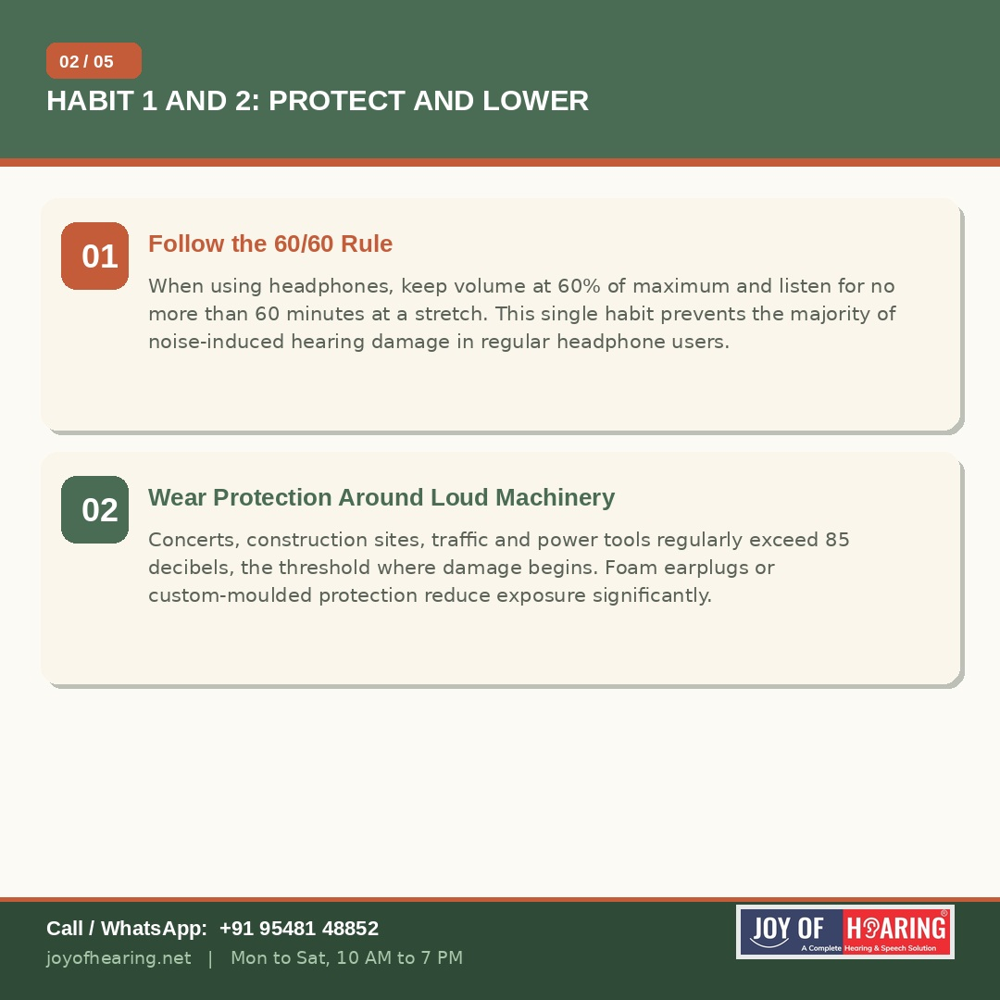
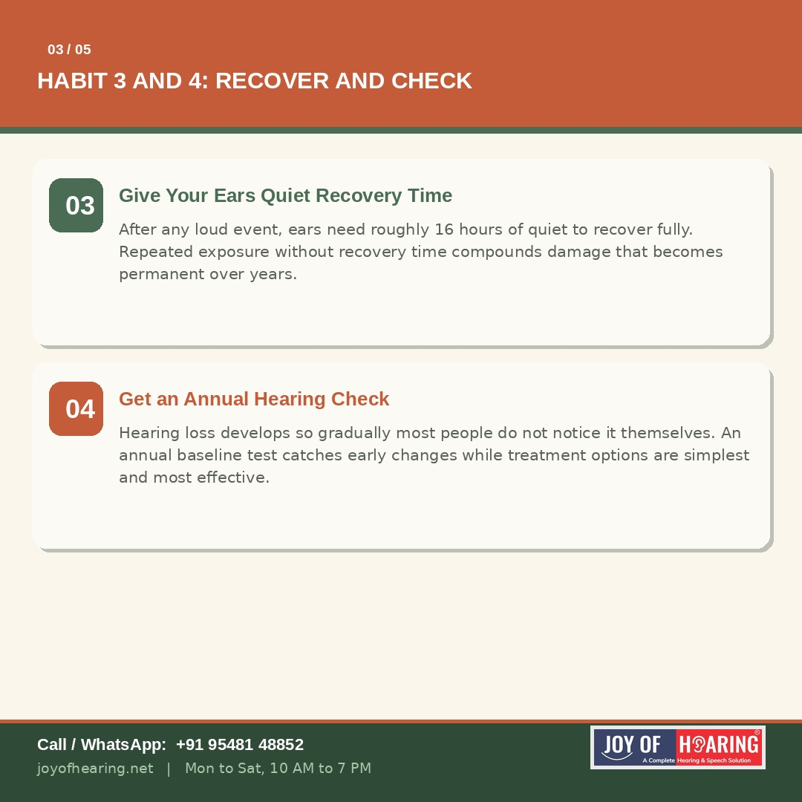
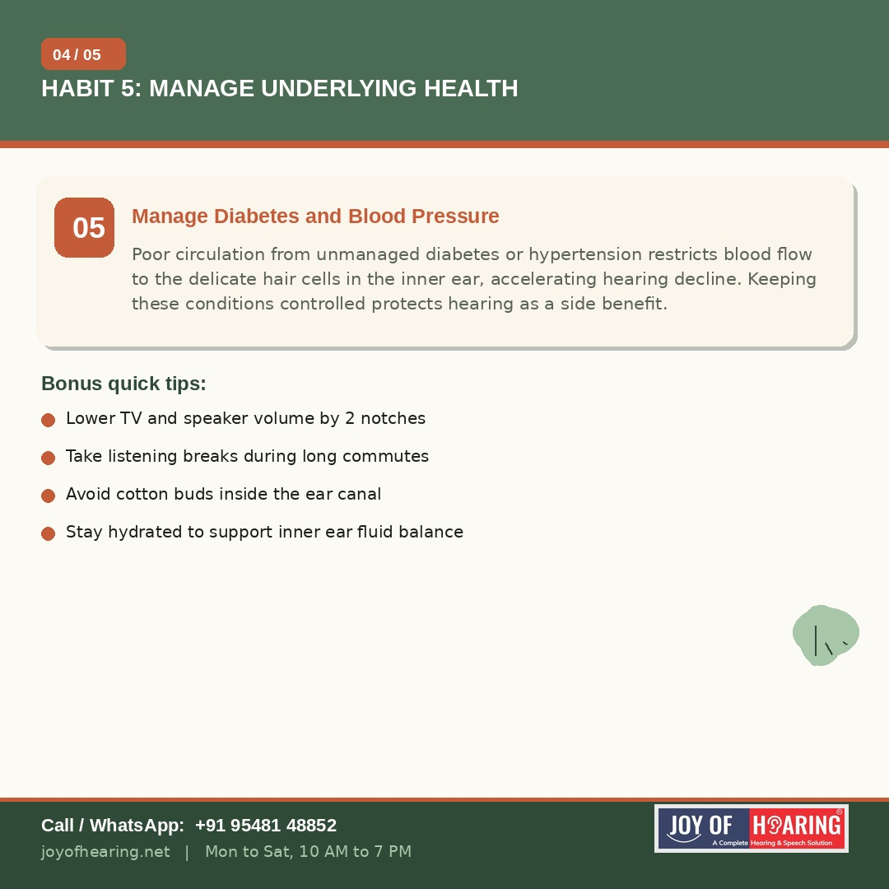
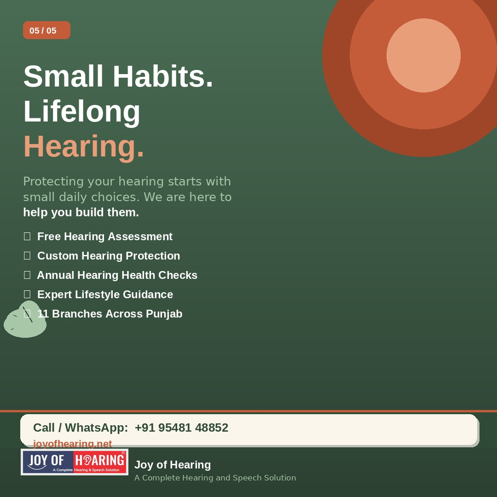

Hearing loss often feels like something that happens to other people, until it happens gradually enough that you do not notice it happening to you. The encouraging truth is that a significant portion of hearing damage, particularly the kind caused by noise exposure, is entirely preventable. A handful of small daily habits can protect your hearing for decades.

## 1. Follow the 60/60 Rule

When using headphones or earphones, keep the volume at 60% of maximum and limit continuous listening to 60 minutes at a time. This single habit addresses the single largest preventable cause of hearing damage among regular headphone users, particularly younger adults.

## 2. Wear Protection Around Loud Machinery

Concerts, construction sites, traffic, power tools and even some kitchen appliances routinely exceed 85 decibels, the threshold at which prolonged exposure begins to damage the delicate hair cells of the inner ear. Foam earplugs are inexpensive and effective. Custom-moulded protection offers even better comfort and attenuation for regular exposure, such as musicians or factory workers.

## 3. Give Your Ears Quiet Recovery Time

After exposure to loud sound, your ears need approximately 16 hours of relative quiet to recover fully. Attending back-to-back loud events, or working in noise without breaks, denies your ears this recovery window and allows damage to accumulate silently over months and years.

## 4. Get an Annual Hearing Check

Hearing loss develops so gradually that most people are the last to notice their own decline. An annual baseline hearing test, much like an annual eye check, catches subtle changes early, when treatment options are simplest and outcomes are best.

## 5. Manage Diabetes and Blood Pressure

This is the habit most people never connect to hearing health. Poor circulation caused by unmanaged diabetes or high blood pressure restricts blood flow to the inner ear's hair cells, accelerating age-related hearing decline. Keeping these conditions well controlled protects your hearing as a meaningful side benefit.

## A Few Bonus Habits Worth Adopting

Lower your television or speaker volume by two notches from your usual setting. Take short listening breaks during long commutes if you use headphones. Avoid inserting cotton buds into the ear canal, as they push wax deeper and risk injury. Stay well hydrated, as adequate fluid balance supports the inner ear's delicate fluid systems.

## Small Choices, Lifelong Hearing

None of these habits require significant effort or cost. What they require is consistency. Hearing you protect today is hearing you keep for the rest of your life.

## Joy of Hearing: Supporting Your Hearing Health

At Joy of Hearing, we offer free hearing assessments, custom hearing protection and annual hearing health checks across 11 branches in Punjab. Protecting your hearing starts with knowing where you stand today.

Call or WhatsApp us at +91 95481 48852 or visit joyofhearing.net to book your free hearing check today.
