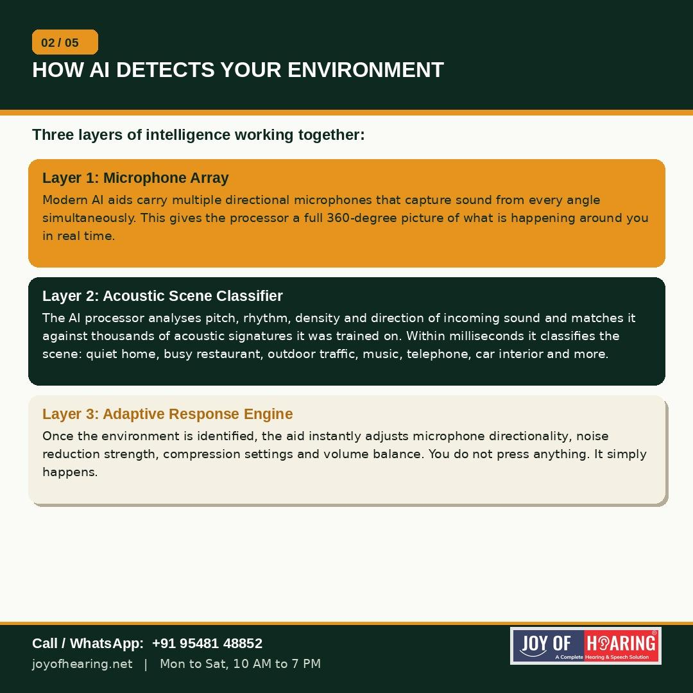
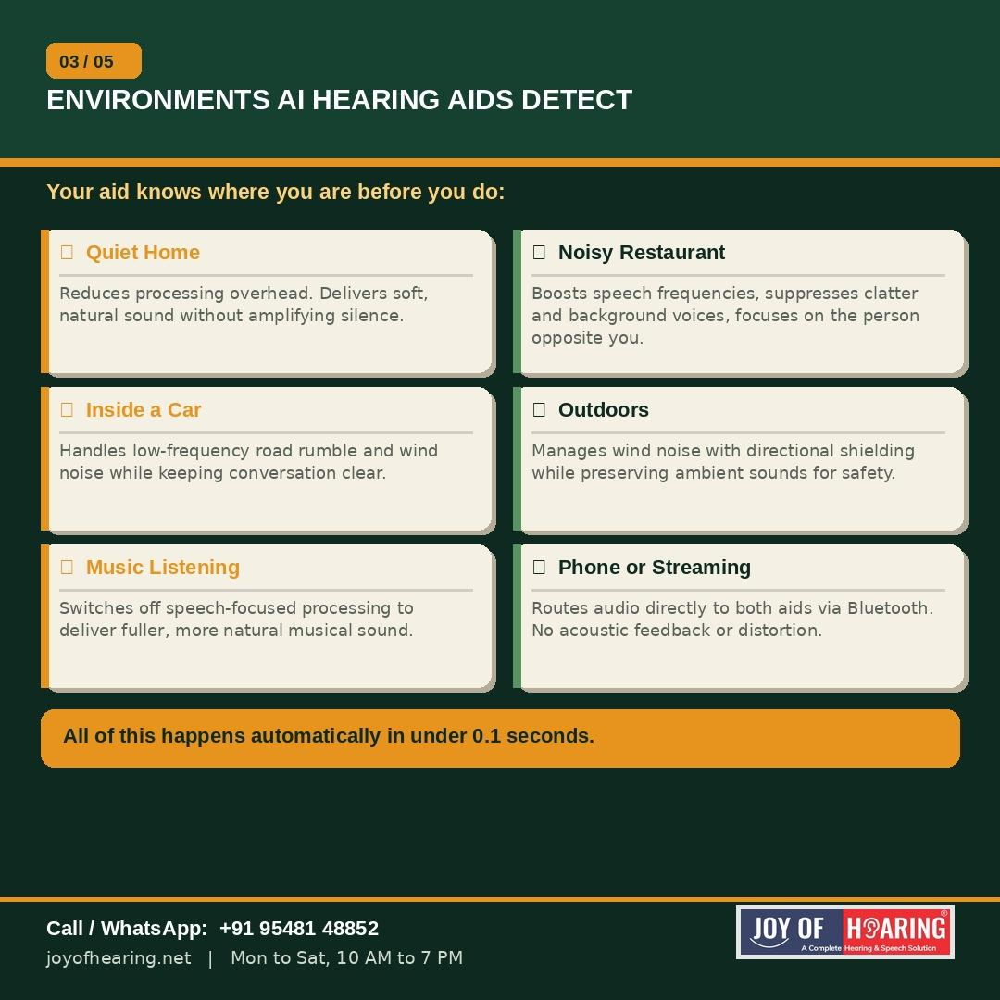
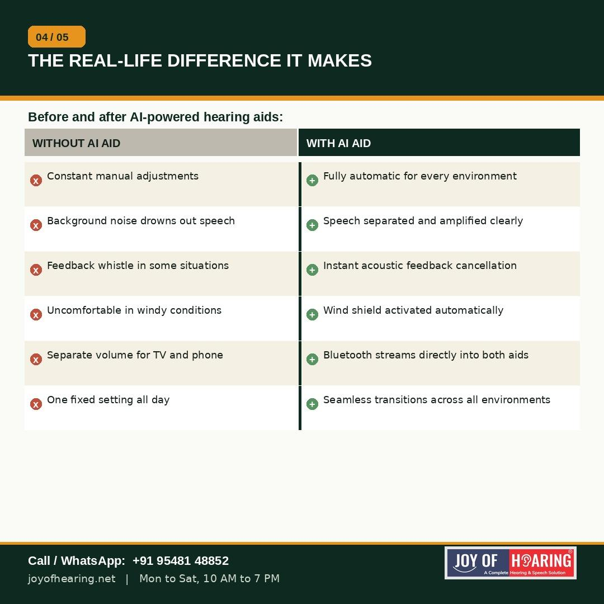
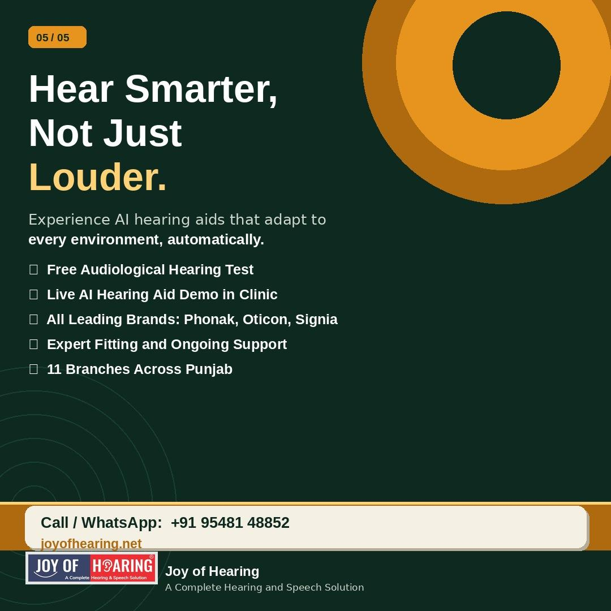

Imagine walking from your living room into a busy wedding hall and your hearing aid adjusting itself before you even notice the change in noise. No button pressed, no app opened, no manual volume dial. This is not a future concept. It is what modern AI hearing aids already do, and understanding how they work helps you make a more informed decision about your own hearing health.

## The Short Answer: Yes, They Can

Today's most advanced hearing aids carry dedicated AI processors that continuously scan the acoustic environment around you, classify it, and reconfigure the device settings in real time. The whole process takes a fraction of a second and happens dozens of times a minute as you move through your day.

## Three Layers of Intelligence

The first layer is the microphone array. Modern AI aids carry multiple directional microphones that capture sound from every angle simultaneously, giving the processor a full 360-degree picture of the acoustic scene around you.

The second layer is the acoustic scene classifier. The processor analyses pitch, rhythm, density and direction of incoming sound and matches it against thousands of pre-learned acoustic signatures. It classifies what it hears: quiet home, noisy restaurant, outdoor traffic, music, phone call, car interior, and more. Phonak's AutoSense OS 5.0 identifies over 7 distinct environments. Oticon's BrainHearing technology performs this scan 500 times every second.

The third layer is the adaptive response engine. Once the scene is identified, the aid immediately adjusts its microphone directionality, noise reduction strength, compression ratio and volume balance. You hear the difference. You did not cause it.

## What This Means for Everyday Life

In a restaurant, the AI focuses on the voice directly in front of you and suppresses the clatter, kitchen noise and background conversations around you. Outdoors, a wind shield activates to remove low-frequency gusting without cutting out traffic sounds you need for safety. Inside a car, road rumble is filtered while keeping conversation in the front seat clear. During music listening, the aid shifts out of speech-focused mode to deliver fuller, more natural sound.

These transitions happen automatically, continuously, every time your environment changes.

## What Has Not Changed

The right starting point is still a proper hearing test. AI processing works best when the device is correctly calibrated to your specific audiogram and lifestyle by a qualified audiologist. The technology handles the environment. The audiologist handles the fit.

At Joy of Hearing, every patient receives a complete hearing assessment before any device is recommended. Our certified audiologists across 11 branches in Punjab will guide you through a live demonstration of AI hearing aids so you can experience the difference firsthand before making any decision.

Call or WhatsApp us at +91 95481 48852 or visit joyofhearing.net to book your free hearing test today.

