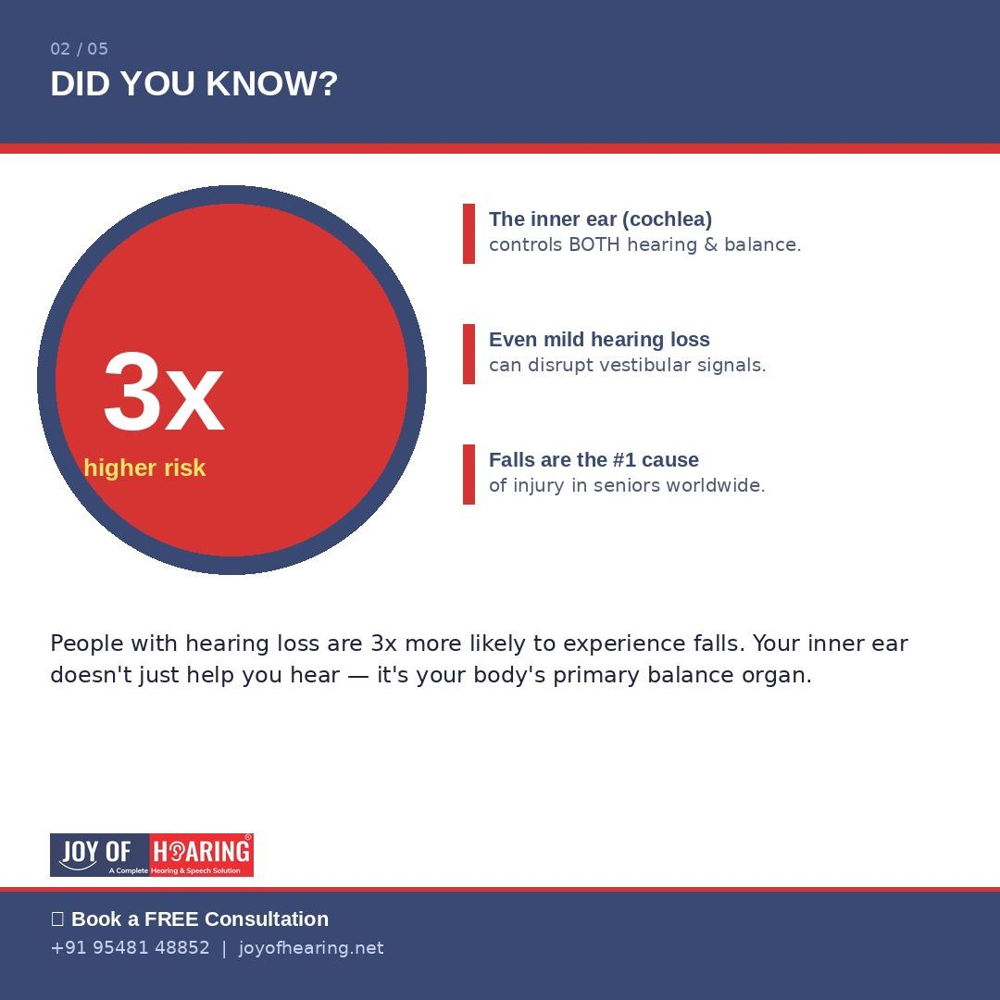
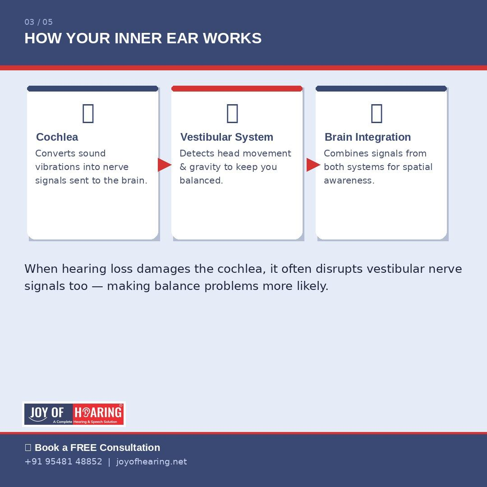
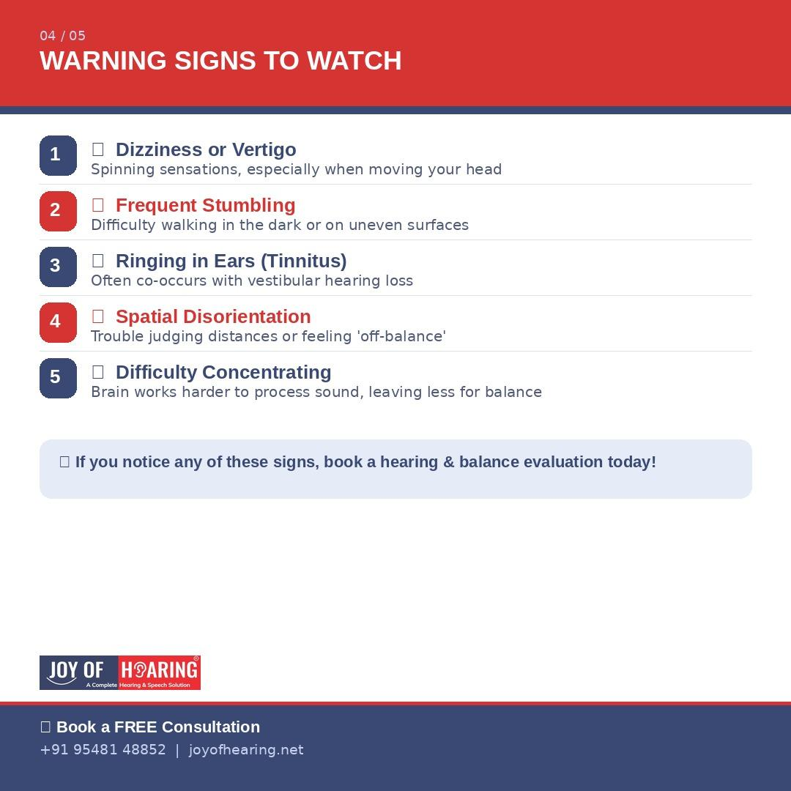
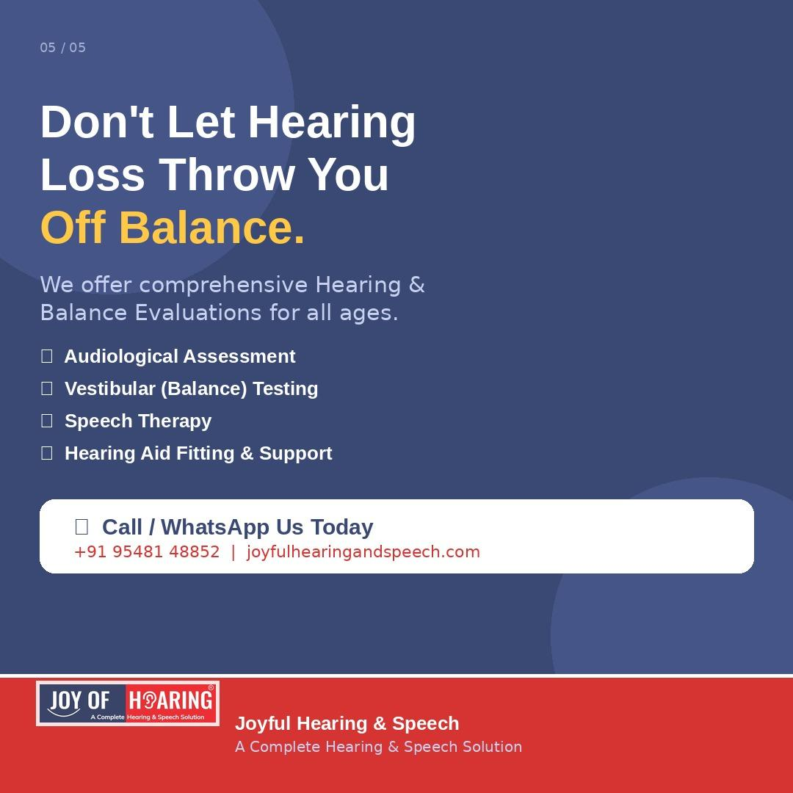

Most people think of hearing loss as purely a communication problem, something that makes conversations harder and turns up the TV volume. But what if your ears are doing far more than just helping you hear? The truth is, your inner ear plays a critical and often overlooked role in keeping you upright, steady, and safe every single day.
## The Inner Ear: Your Body's Hidden Balance Center
Deep inside your ear sits a remarkable structure called the vestibular system. Alongside the cochlea, the part responsible for translating sound vibrations into nerve signals, the vestibular system constantly monitors your head's position, movement, and orientation in space. These two systems share the same fluid, the same nerve pathways, and often the same vulnerabilities. When one is damaged, the other frequently suffers too.

## What the Research Shows
Studies consistently show that individuals with even mild hearing loss are nearly three times more likely to experience falls than those with normal hearing. This is not a coincidence. When the cochlea is damaged by age-related degeneration, noise exposure, infection, or disease, the vestibular nerves running alongside it can be affected simultaneously, directly disrupting your body's ability to maintain coordinated, stable movement.

There is a secondary effect too. When the brain must work harder to process degraded or incomplete sound signals, less cognitive bandwidth remains available for balance, posture control, and spatial awareness. This "cognitive load" effect is a significant but widely underappreciated contributor to falls and disorientation among people with untreated hearing loss.

## Warning Signs You Should Never Ignore
If you or a loved one experiences any of the following, it is time to seek a professional evaluation:
* Recurring dizziness or vertigo episodes
* Difficulty walking in low light or on uneven surfaces
* A persistent feeling of being "off-balance" without a clear cause
* Tinnitus (ringing or buzzing in the ears) combined with unsteadiness
* Frequent stumbling or unexplained falls

These symptoms may indicate vestibular hearing loss a condition in which both hearing function and balance regulation are compromised and require specialist attention.

## How Joyful Hearing & Speech Can Help
At Joyful Hearing & Speech, our experienced audiologists provide comprehensive hearing and balance evaluations personalised for every patient and every age group. Early diagnosis is the most powerful tool available; it opens the door to targeted treatment, improved safety, and a significantly better quality of life.

Our services include full audiological assessment, vestibular balance testing, hearing aid fitting and fine-tuning, and speech therapy all available under one roof.

Your balance matters just as much as your hearing. Do not wait for a fall to find out.

📞 Call us at +91 95481 48852 or visit [joyofhearing.net](https://joyofhearing.net) to book your free Hearing & Balance Evaluation today.

