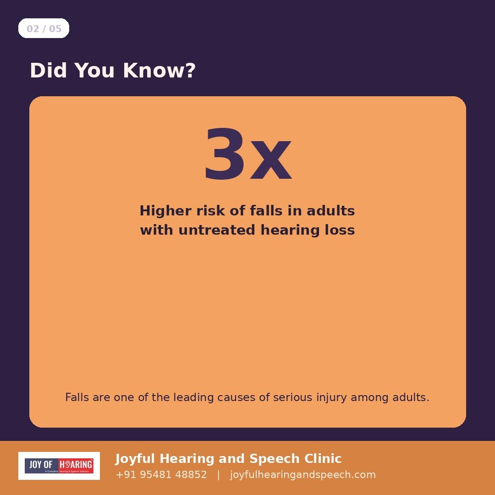
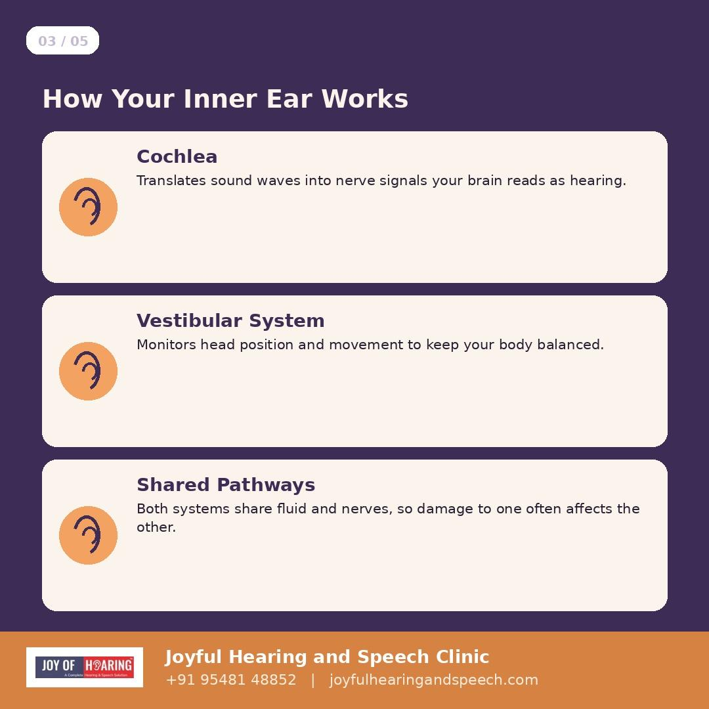
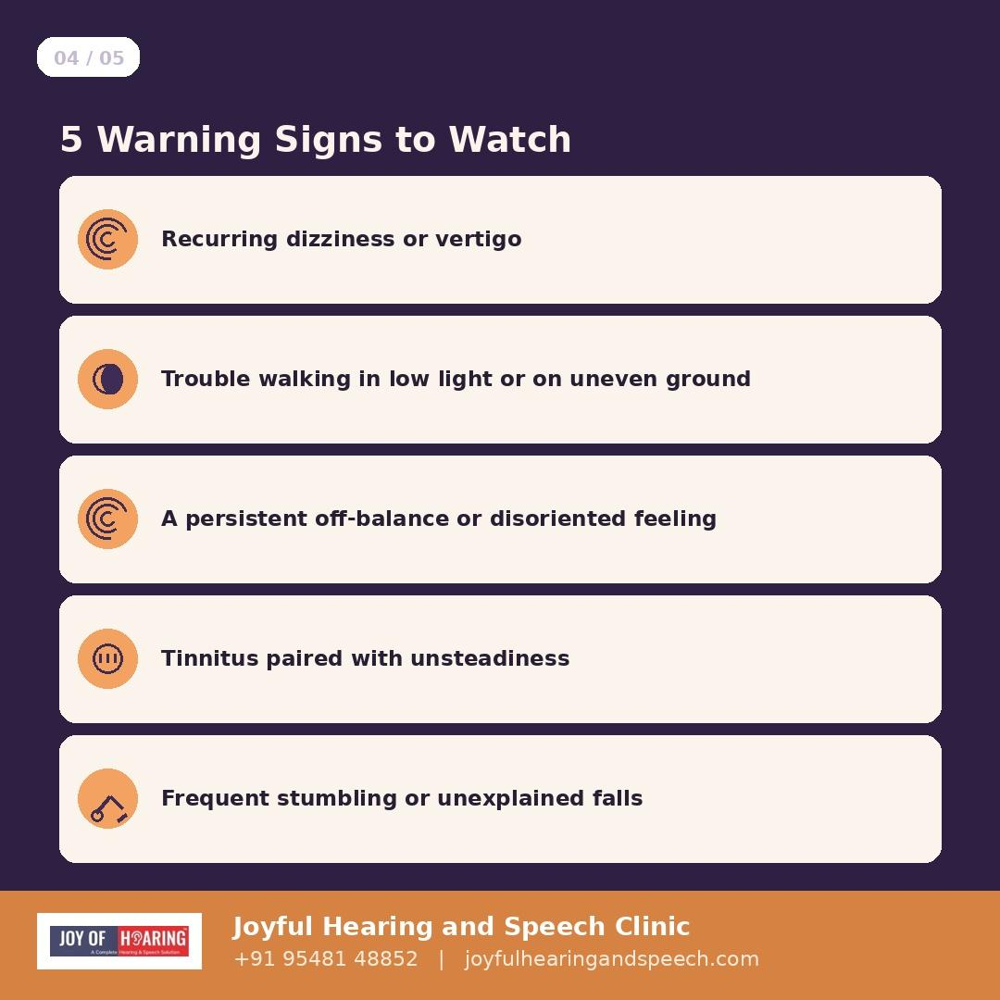
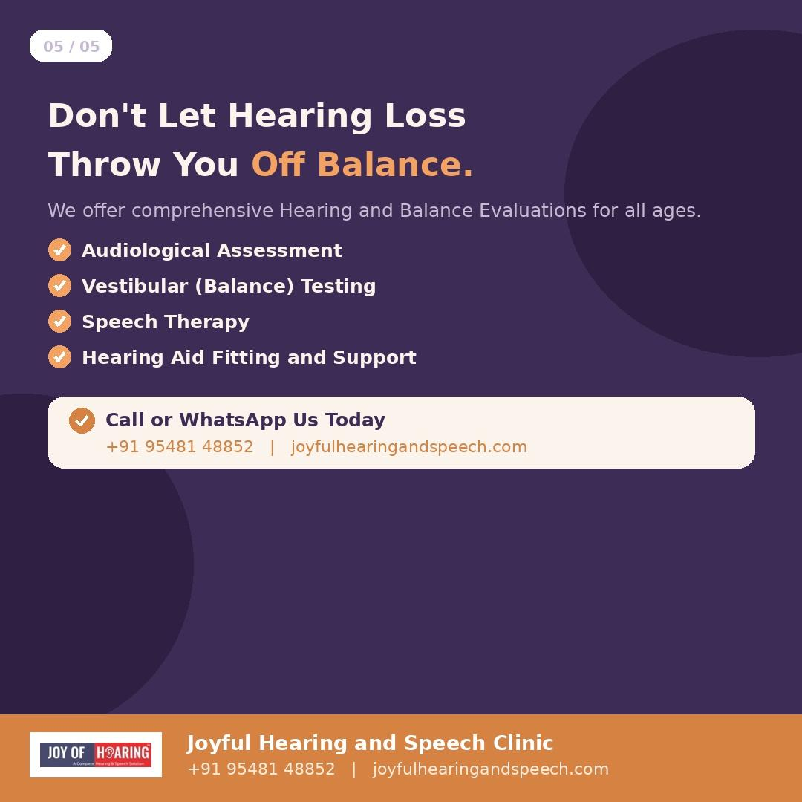

When people think about the consequences of hearing loss, they usually think about missed conversations or turned-up televisions. Few people think about depression. Yet research consistently shows that adults with untreated hearing loss are significantly more likely to experience depressive symptoms, and the connection is stronger than most families realise.

## Why the Link Exists

Hearing loss does not happen in isolation. It changes how a person participates in the world around them. Conversations become effortful. Group settings become exhausting. Phone calls become a source of anxiety rather than connection. Over time, many people begin avoiding the situations that used to bring them joy, not because they want to withdraw, but because the mental effort of straining to hear has simply become too draining.

This gradual withdrawal is where the real damage happens. Social connection is one of the strongest protective factors against depression at any age. When hearing loss quietly erodes that connection, it removes a layer of psychological protection a person did not know they were relying on.

## The Numbers Are Significant

Studies published in leading geriatric and psychiatric journals have found that adults with hearing loss face a notably higher risk of depressive symptoms compared to those with normal hearing, and the risk increases with the severity of the loss. Older adults are particularly vulnerable, as hearing loss often coincides with retirement, reduced mobility, and smaller social circles, compounding the isolation.

## It Is Rarely Framed as a Hearing Problem

This is what makes the connection so easy to miss. A person who has become withdrawn, quieter, or less interested in socialising is often assumed to be dealing with a purely emotional or age-related change. Family members raise concerns about mood, not hearing. Hearing loss is rarely the first thing anyone investigates, even though it may be the root cause.

## The Encouraging Part: Treatment Helps Both

This is where the story turns hopeful. Multiple studies have found that hearing aid use is associated with measurable improvements in mood, social engagement, and quality of life. Patients frequently describe feeling like themselves again within weeks of consistent hearing aid use, not because the hearing aid treats depression directly, but because it removes the daily barrier that was quietly driving the withdrawal.

## What Families Can Do

If a loved one has become noticeably quieter, less social, or seems low in mood, it is worth asking a simple question before assuming the cause is purely emotional: when was their hearing last checked? A comprehensive hearing assessment takes under an hour and can reveal whether an underlying, treatable cause is contributing to what looks like a mental health decline.

## Joy of Hearing: Supporting the Whole Person

At Joy of Hearing, our audiologists take a whole-person approach to every assessment across 11 branches in Punjab. We understand that hearing health and emotional wellbeing are deeply connected, and our team is here to support both.

Call or WhatsApp us at +91 95481 48852 or visit joyofhearing.net to book a comprehensive hearing assessment today.

