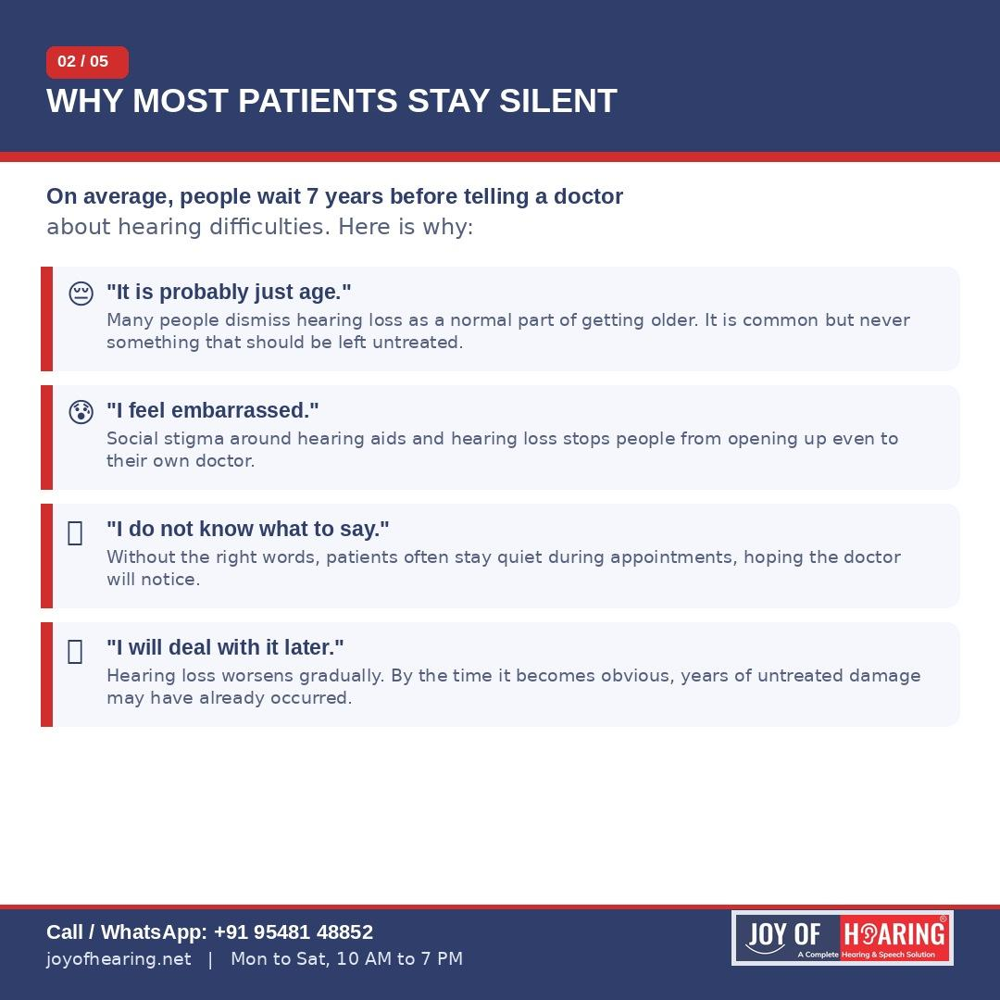
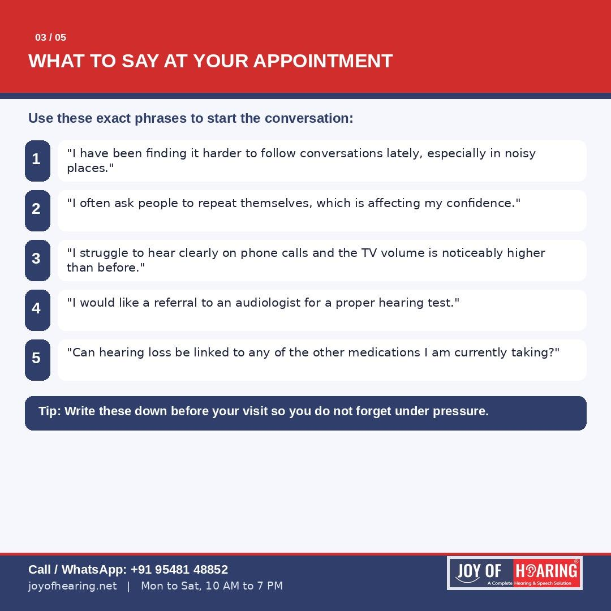
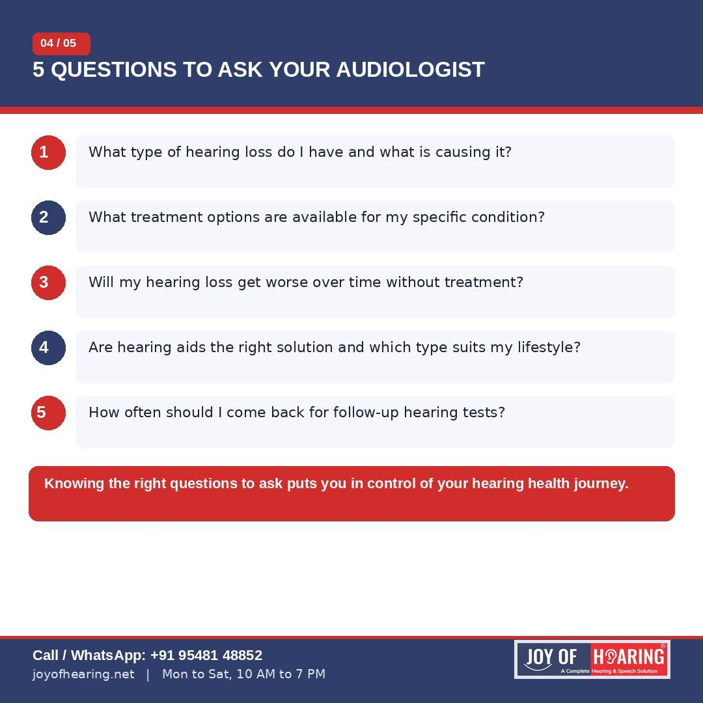
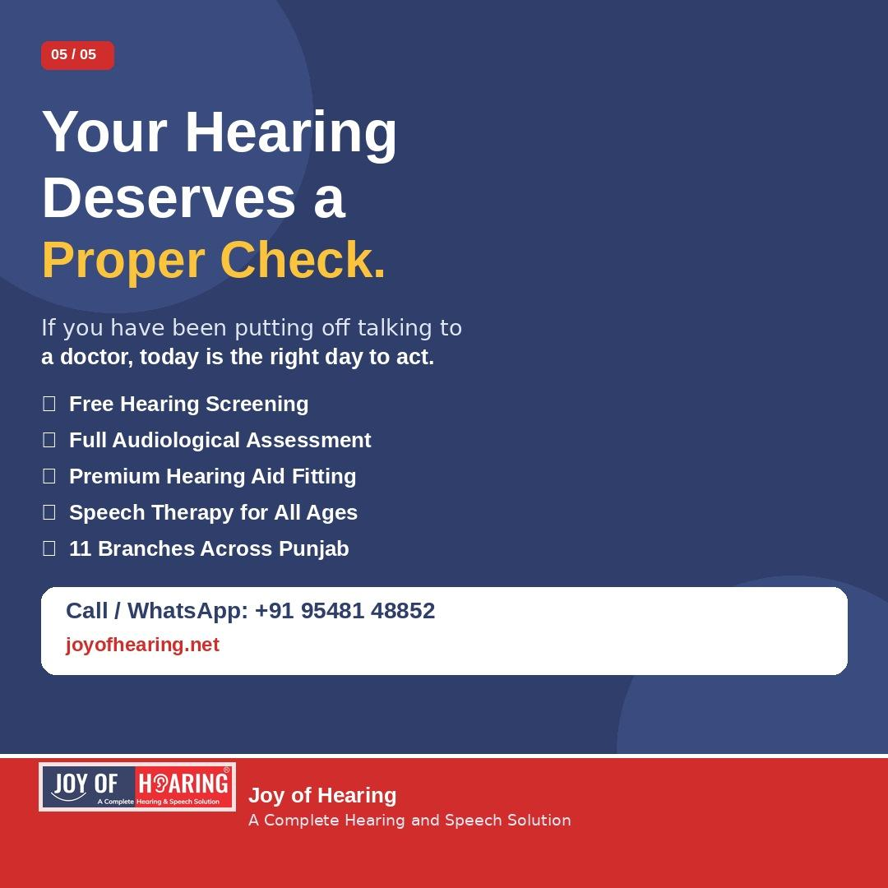

Most people wait an average of seven years before telling a doctor about their hearing difficulties. Seven years of missed conversations, turned-up televisions, and nodding along without fully understanding what was said. If this sounds familiar, you are not alone and you are not without options.

The first and most important step is also the one most people put off: starting the conversation with a healthcare professional.

## Why People Stay Quiet

The reasons are understandable. Some assume hearing loss is simply a normal part of ageing and not worth mentioning. Others feel embarrassed or worry about being judged. Many simply do not know how to bring it up during a routine appointment that is already focused on other things. Whatever the reason, the longer hearing loss goes unaddressed, the greater the impact on quality of life, relationships, mental health, and even cognitive function.

## How to Bring It Up

You do not need medical terminology to start this conversation. Here are some straightforward phrases you can use:

* "I have been finding it harder to follow conversations, especially in busy or noisy environments."
* "I notice I ask people to repeat themselves far more often than I used to."
* "The volume on my television has been going up steadily and I am still not hearing everything clearly."
* "I would like a referral to an audiologist for a formal hearing evaluation."

Writing these down before your appointment takes the pressure off remembering them in the moment. Your doctor will take these concerns seriously and a referral to a qualified audiologist is the logical next step.

## Questions to Ask Your Audiologist

Once you have your appointment, come prepared with these questions:

* What type of hearing loss do I have and what is causing it?
* What are my treatment options based on my specific results?
* Will my hearing get worse over time without treatment?
* Are hearing aids the right solution and which style would suit my lifestyle?
* How often should I come back for follow-up tests?

## What Happens at a Hearing Test

A standard audiological assessment at Joy of Hearing is painless, non-invasive, and takes around 30 to 45 minutes. Your audiologist will test your ability to detect sounds across different frequencies and speech clarity levels. The results are mapped onto an audiogram, which clearly shows the type, degree, and pattern of any hearing loss.

Armed with that information, the right treatment path becomes clear. Whether that means hearing aids, therapeutic support, or simply regular monitoring, you will leave with answers rather than uncertainty.

## Take the First Step Today

At Joy of Hearing, our certified audiologists across 11 branches in Punjab are here to guide you from that first conversation all the way through to treatment and follow-up care.

Call or WhatsApp us at +91 95481 48852 or visit joyofhearing.net to book your free hearing screening. Your ears have been patient long enough.

