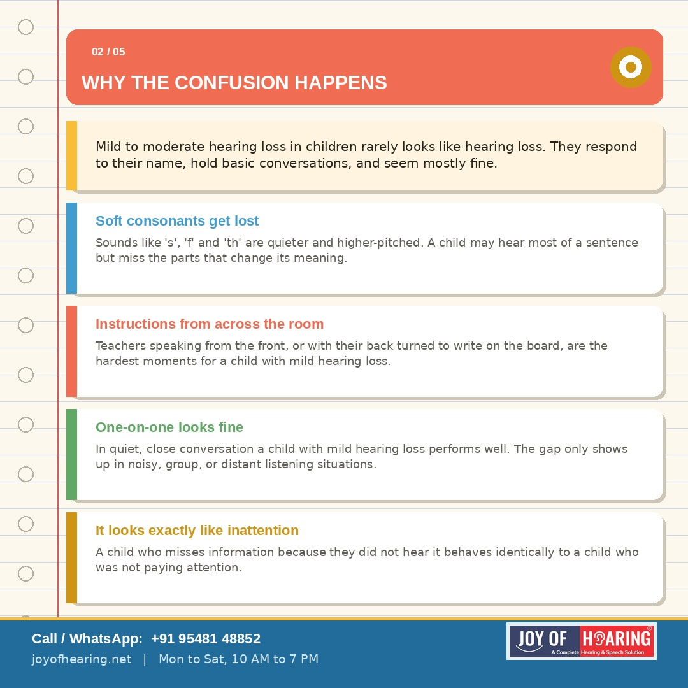
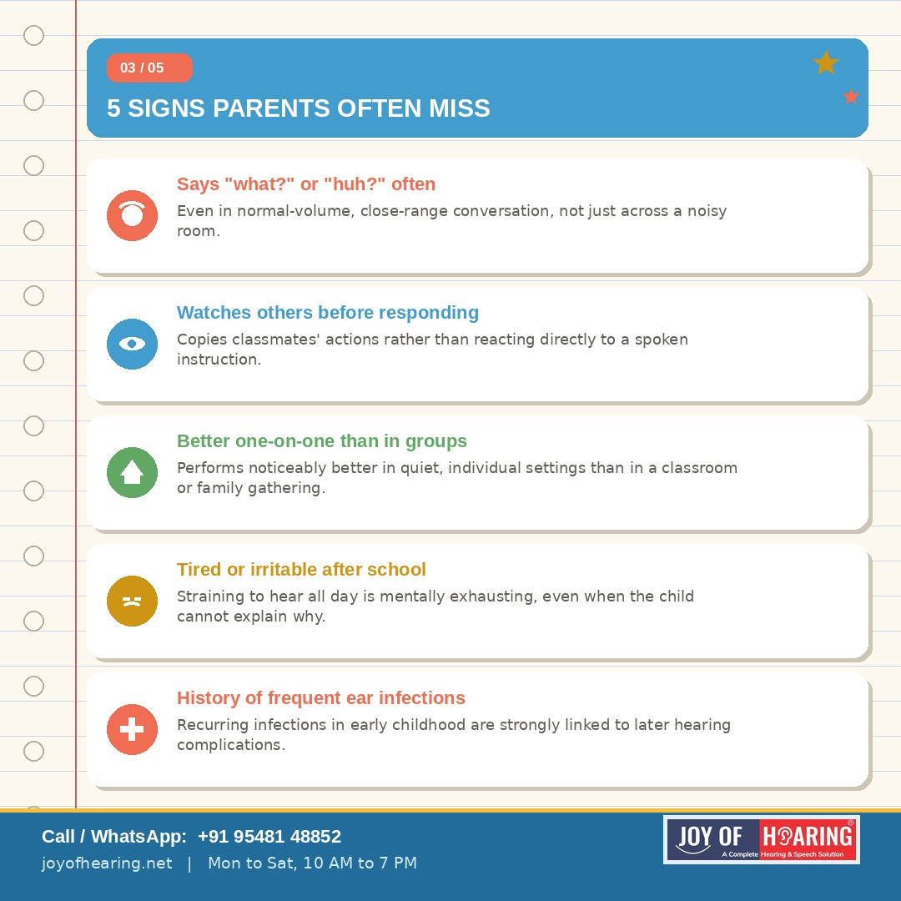
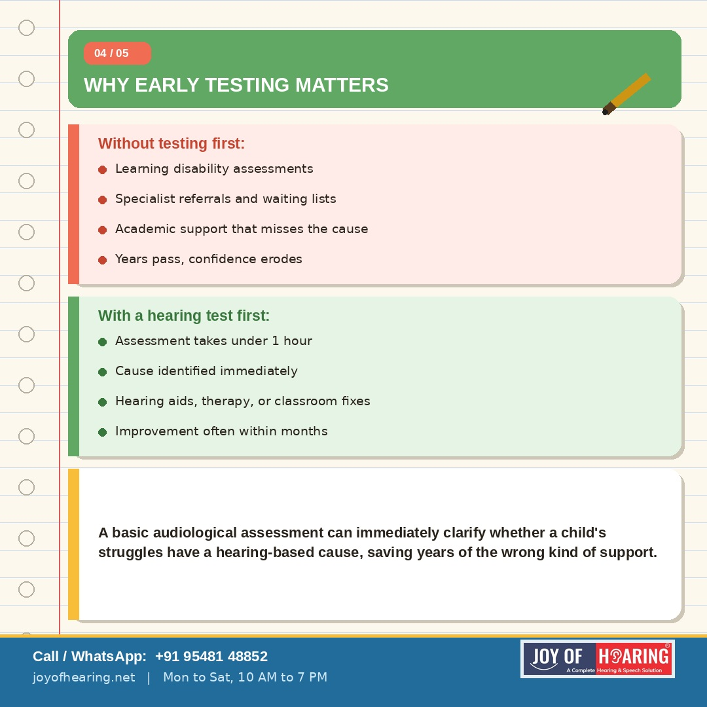
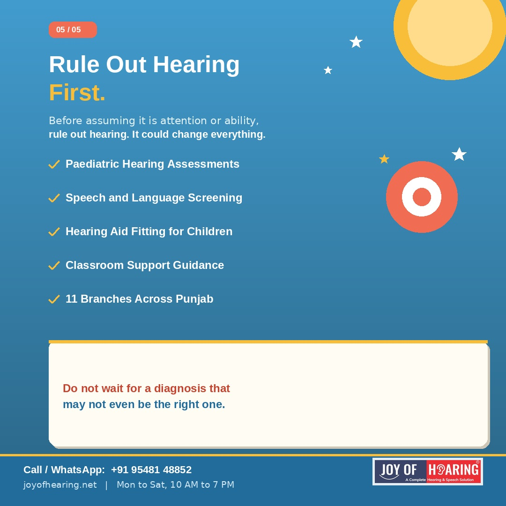

A child who struggles to follow instructions, seems distracted in class, or falls behind academically is often assumed to have a learning or attention difficulty. In a significant number of cases, the real cause is something far more treatable and far more overlooked: undiagnosed hearing loss.

## Why the Confusion Happens

Mild to moderate hearing loss in children rarely looks like hearing loss. A child with partial hearing loss can still hear most sounds, respond to their name most of the time, and hold basic conversations. What they miss are the subtler parts: soft consonants, instructions given from across a noisy classroom, or a teacher speaking with their back turned. The result looks exactly like inattention, slow processing, or a learning disability, because the child is genuinely missing information, just not in a way anyone suspects.

## The Overlap Is Larger Than Most Parents Realise

Research consistently shows that children with even mild, undetected hearing loss are significantly more likely to be misdiagnosed with attention deficit disorders or general learning difficulties. Teachers see a child who is not responding appropriately and reasonably assume a cognitive or behavioural cause. Hearing is rarely the first thing tested, because the child does not appear deaf in the everyday sense.

## Warning Signs Parents and Teachers Often Miss

A child who consistently asks "what?" or "huh?" even in normal-volume conversation. A child who watches other children before following instructions, effectively lip reading or copying peers rather than hearing the instruction directly. A child who performs noticeably better in one-on-one settings than in a group or classroom. A child who appears tired or irritable after school, often linked to the mental fatigue of straining to hear all day. A child with frequent ear infections in early childhood, which are strongly linked to later hearing complications.

## Why Early Testing Changes Everything

A basic audiological assessment takes under an hour and can immediately clarify whether a child's academic or behavioural struggles have a hearing-based cause. When hearing loss is identified and addressed, whether through hearing aids, classroom accommodations, or speech therapy, academic performance and social confidence often improve dramatically within months.

The alternative, a prolonged and unnecessary path through learning disability assessments, specialist referrals, and academic support systems that do not address the actual cause, can take years and leave a child feeling as though something is fundamentally wrong with them, when the real issue was simply not being heard clearly.

## Joy of Hearing: Get the Right Diagnosis First

At Joy of Hearing, our paediatric audiologists provide comprehensive hearing assessments for children of all ages across 11 branches in Punjab. If your child is struggling in school and no one has ruled out hearing loss yet, that is always the right place to start.

Call or WhatsApp us at +91 95481 48852 or visit joyofhearing.net to book your child's hearing assessment today.
