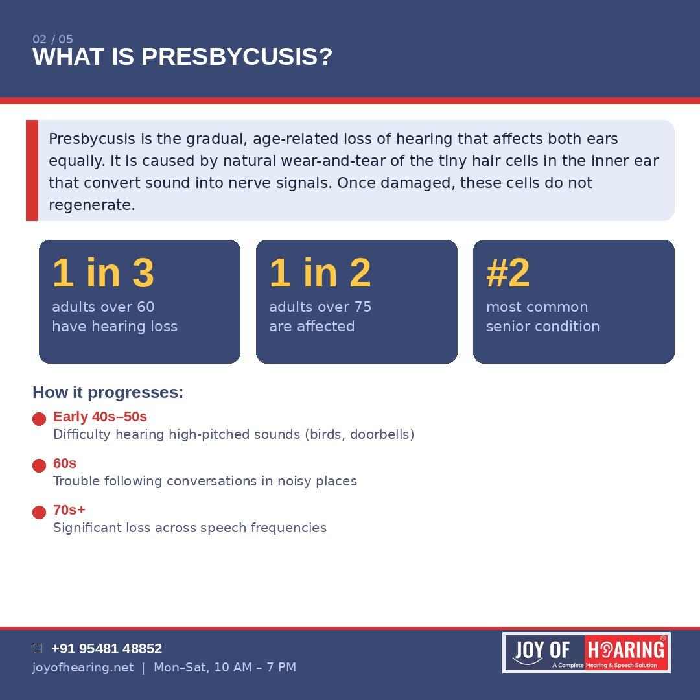
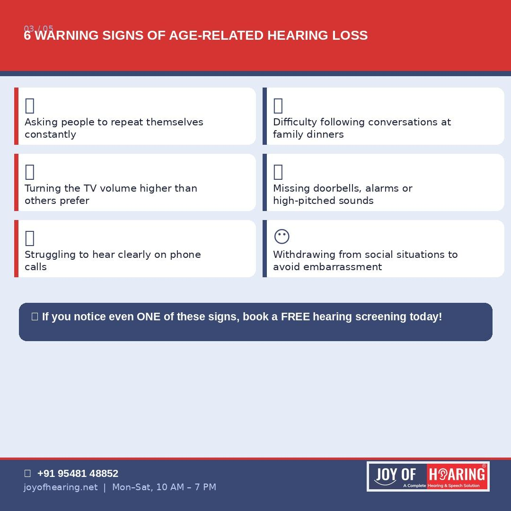
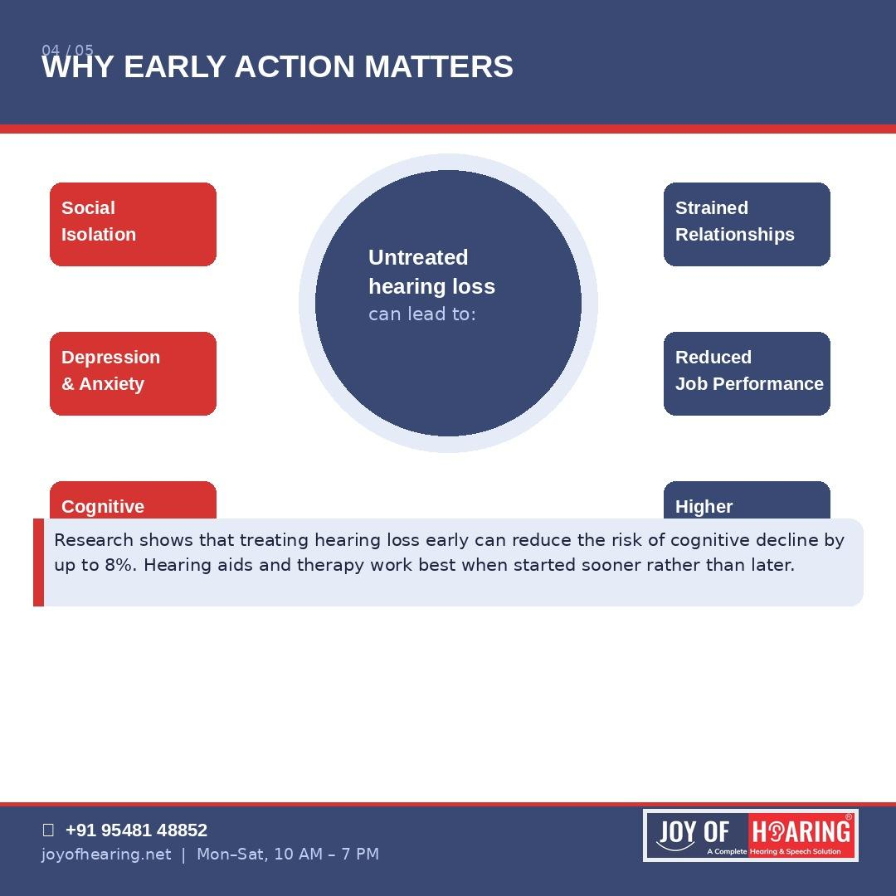
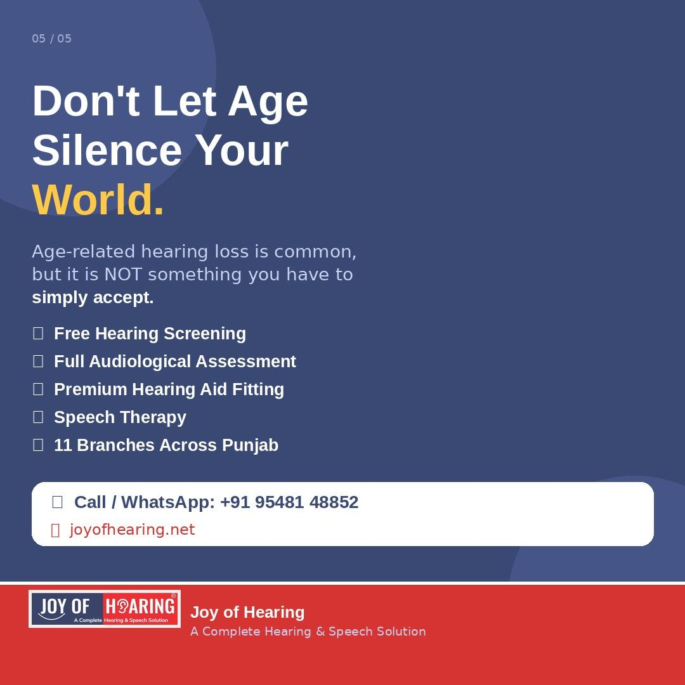

We often expect some changes as we grow older: greying hair, reading glasses, the occasional aching knee. But one change that rarely gets the attention it deserves is the gradual, progressive loss of hearing. Known clinically as presbycusis, age-related hearing loss is one of the most common conditions affecting adults over the age of 40 and yet most people wait seven to ten years before seeking help.

## What Is Presbycusis?
Presbycusis is the slow, natural deterioration of hearing that occurs as we age. It is caused by the wear-and-tear of the tiny sensory hair cells located deep inside the cochlea, the spiral-shaped organ in the inner ear that converts sound vibrations into electrical signals the brain can interpret. Unlike skin or bone, these hair cells do not regenerate once damaged. Every decade of noise exposure, infection, and natural ageing takes its toll, quietly narrowing the range of sounds we can detect.
The condition typically begins in the higher frequencies: the pitch of birdsong, a ringing phone, or a grandchild's voice, before gradually affecting the speech frequencies that govern everyday conversation.
  

## How Common Is It?
Age-related hearing loss is far more prevalent than most people realise. Approximately one in three adults over the age of 60 experiences meaningful hearing loss. By the age of 75, that figure rises to one in two. In India, where awareness of audiological care remains limited in many communities, a significant number of affected individuals never receive a formal diagnosis.
## Warning Signs to Watch For
* Frequently asking family members to repeat themselves
* Turning the television volume higher than others find comfortable
* Struggling to follow conversations in restaurants or group settings
* Difficulty hearing clearly on telephone calls
* Missing doorbells, alarms, or other high-pitched environmental sounds
* Gradually withdrawing from social situations to avoid the frustration of mishearing
## Why Acting Early Makes All the Difference
Untreated presbycusis does not remain a hearing problem for long. Research consistently links prolonged untreated hearing loss with increased risks of social isolation, clinical depression, anxiety and accelerated cognitive decline. Studies suggest that treating hearing loss proactively may reduce the risk of dementia by up to eight per cent.
Modern hearing aids are no longer the bulky, whistling devices of the past. Today's instruments are discreet, rechargeable, Bluetooth-enabled, and calibrated precisely to each patient's audiogram, restoring not just volume but the clarity and richness of natural sound.
  

  

## Joy of Hearing Is Here to Help
At Joy of Hearing, our certified audiologists provide comprehensive hearing assessments for patients of all ages across our 11 branches in Punjab, including Jalandhar, Mohali, Hoshiarpur, Nawanshahr, and beyond. Whether you are noticing the first subtle signs or have been struggling for years, it is never too late to take action.
📞 Call or WhatsApp us at +91 95481 48852 or visit [joyofhearing.net](https://joyofhearing.net) to book your free hearing screening today.

