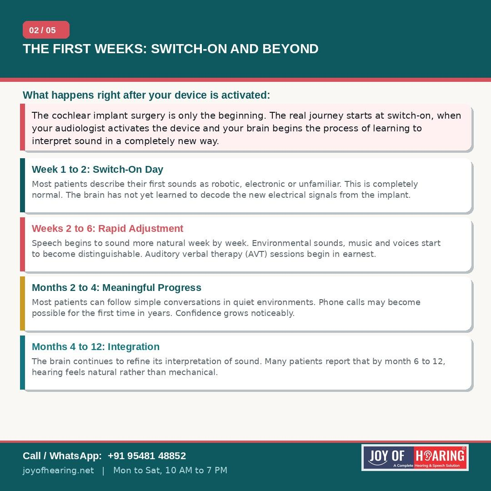
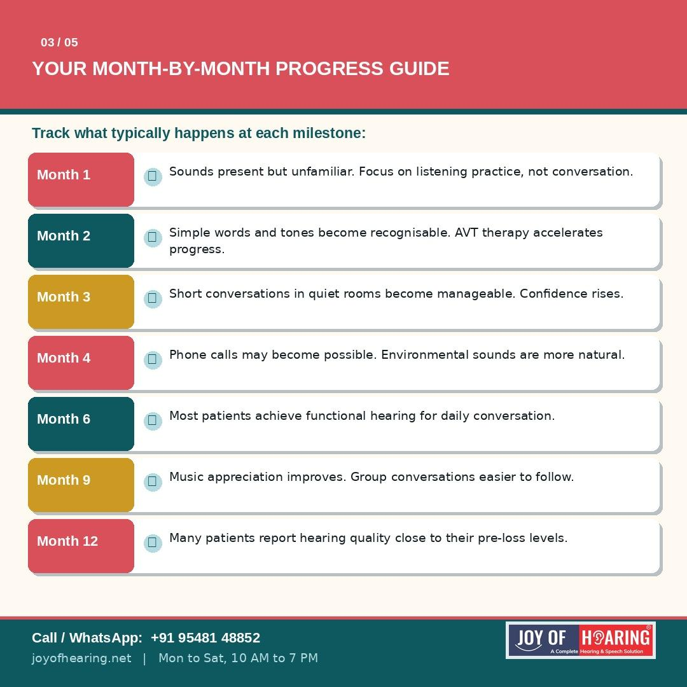
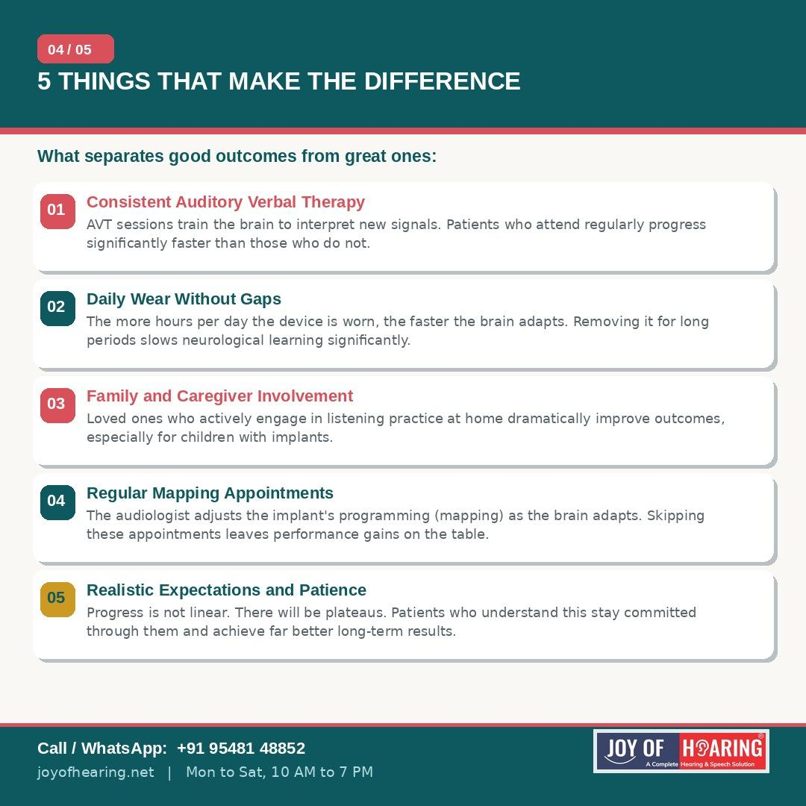
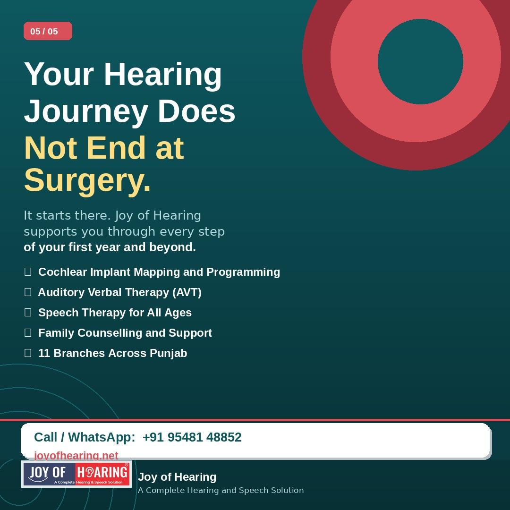

The cochlear implant surgery is only the beginning. For many patients and families, it is the moment they have waited months or years for. But what happens next is equally important and far less talked about. The first year after a cochlear implant is a journey of neurological learning, gradual adaptation and, for most patients, remarkable progress.

## Switch-On Day: The First Sound

Activation typically takes place two to four weeks after surgery, once healing is complete. On switch-on day, the audiologist activates the external processor for the first time and maps the device to the patient's specific hearing nerve responses. Most patients describe their first sounds as robotic, electronic or nothing like they expected. Some cry. Some laugh. Many feel confused.

This is completely normal. The brain has spent months or years without meaningful auditory input. It needs time to learn an entirely new way of processing sound delivered through electrical stimulation rather than the mechanical vibrations of a functioning cochlea.

## The First Three Months: Rapid Progress

The brain's ability to adapt, particularly in children, is extraordinary. Within the first eight to twelve weeks, most patients report that voices begin to sound more natural and that environmental sounds become distinguishable. Simple conversations in quiet settings become manageable. For children receiving implants early in life, progress during this period can be dramatic.

Auditory verbal therapy (AVT) is the critical support structure during this phase. Regular sessions with a qualified therapist train the brain to interpret the new signals effectively and build the listening skills that underpin speech and language development.

## Months Four to Twelve: Integration and Confidence

By the middle of the first year, many adult patients can follow conversations in noisy environments, manage phone calls and enjoy music in a meaningful way. Children implanted early often begin catching up to their hearing peers in language milestones. The device begins to feel natural rather than mechanical.

Regular mapping appointments with an audiologist remain essential throughout this period. As the brain adapts, the programming of the implant needs to be adjusted to match. Patients who attend these sessions consistently achieve significantly better outcomes than those who do not.

## Five Things That Make the Biggest Difference

Consistent auditory verbal therapy attendance accelerates progress more than any other single factor. Wearing the device for as many hours as possible each day gives the brain maximum learning time. Active involvement from family members in home listening practice, particularly for children, dramatically improves results. Regular mapping sessions ensure the device is always performing at its best. And perhaps most importantly, realistic expectations and patience keep patients committed through the inevitable plateaus.

## Joy of Hearing: With You Every Step

At Joy of Hearing, our cochlear implant care does not end at surgery. Our certified audiologists and speech therapists provide full programming support, AVT therapy and family counselling across 11 branches in Punjab throughout your first year and beyond.

Call or WhatsApp us at +91 95481 48852 or visit joyofhearing.net to book your cochlear implant mapping or AVT consultation today.

