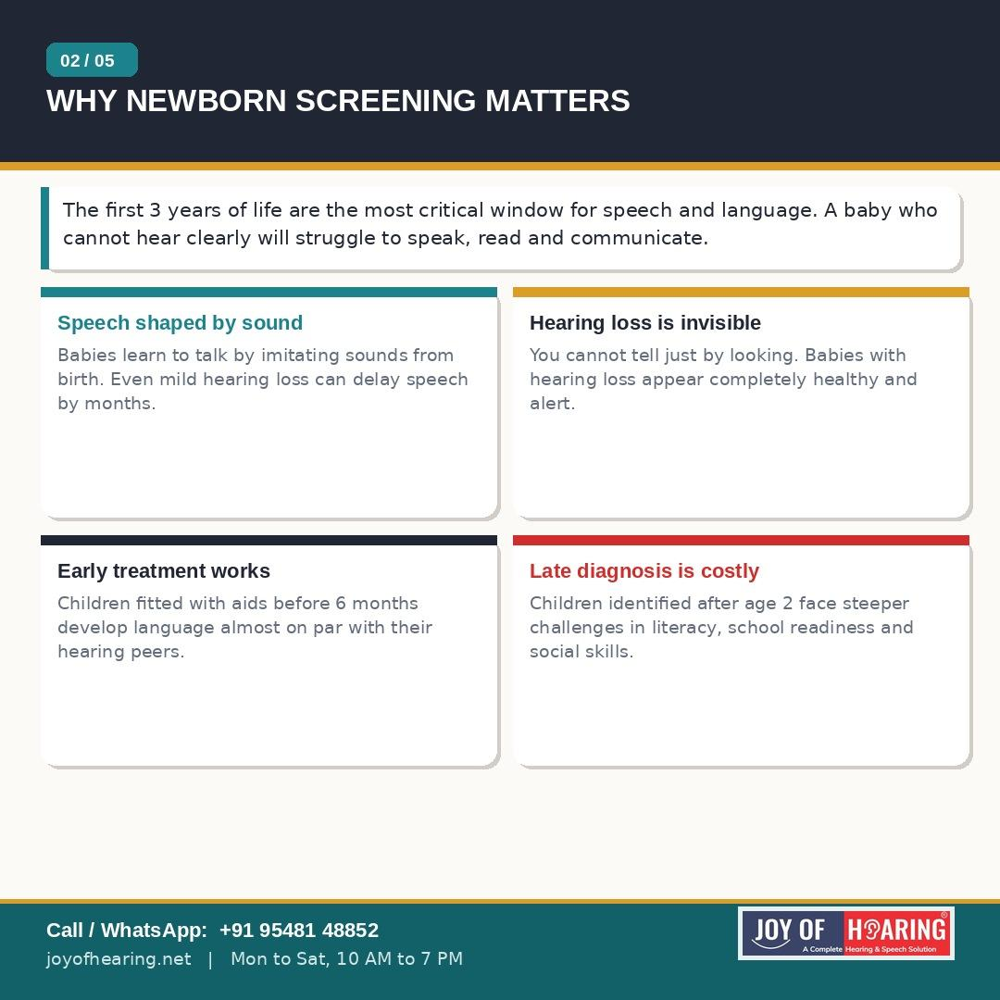
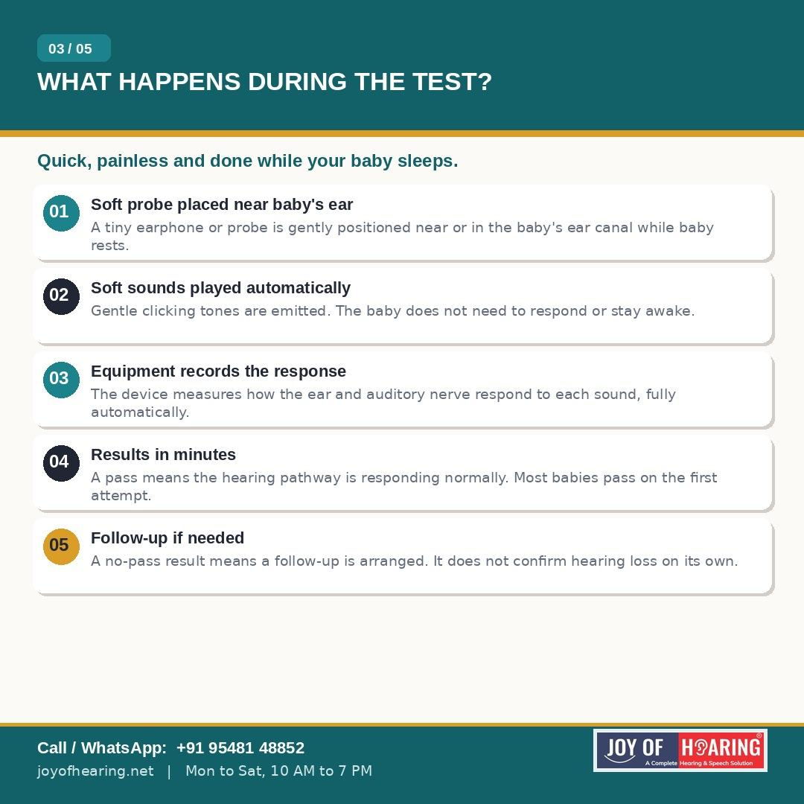
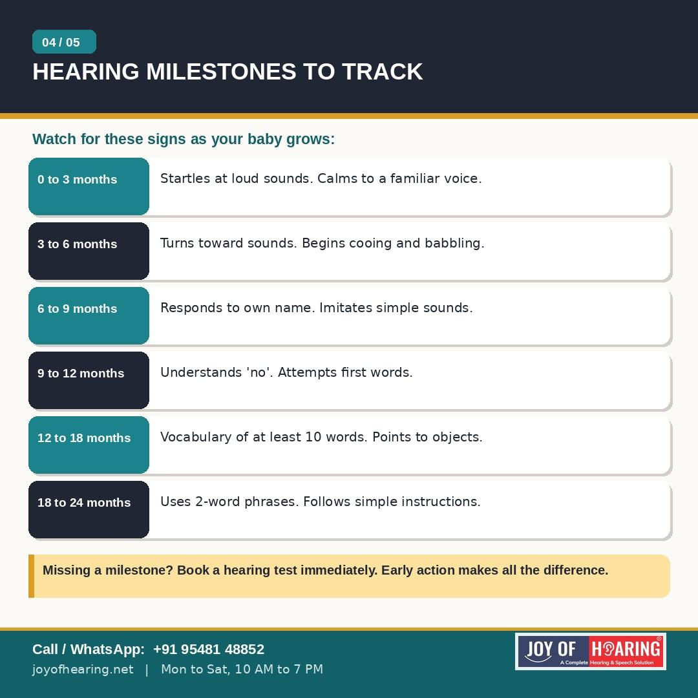
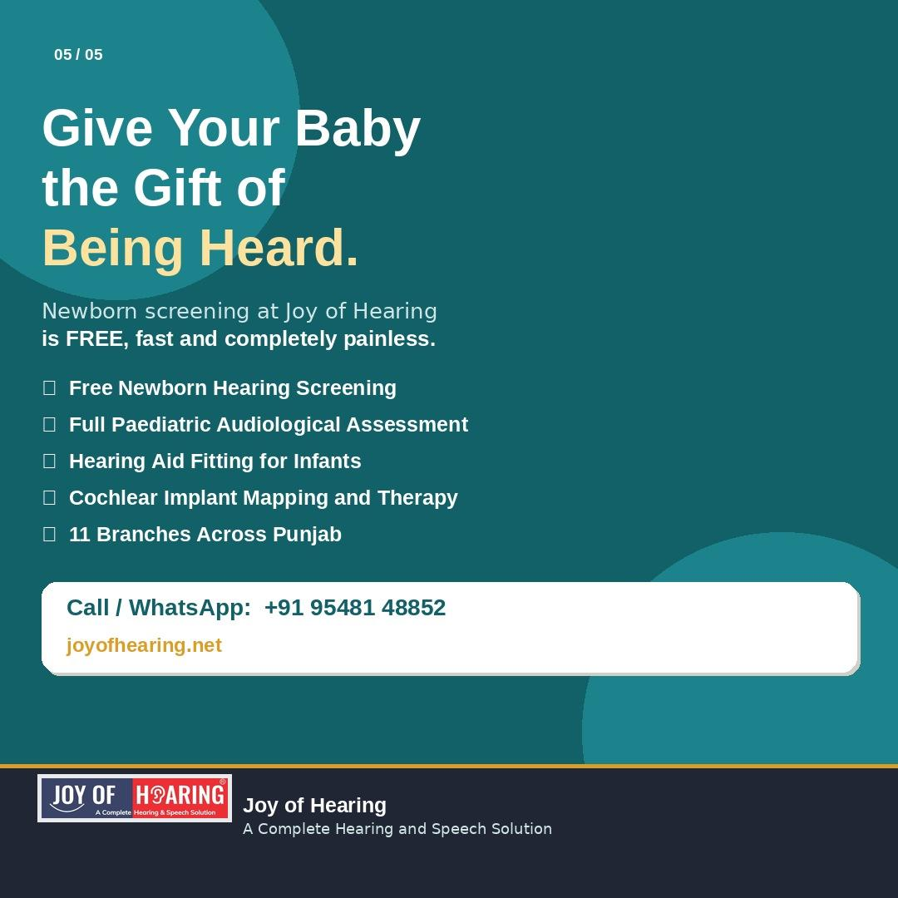

The first sound your newborn hears may be your voice. But how do you know for certain that your baby is hearing it clearly? Hearing loss in newborns is one of the most common conditions present at birth, affecting approximately 1 in every 1,000 babies. Unlike many other conditions, it leaves no visible signs. A baby with hearing loss will still smile, make eye contact, react to movement, and appear completely healthy. This is exactly why newborn hearing screening is not optional; it is essential.

## Why the First Few Months Are Critical

The first three years of life are the most important window for speech and language development. The brain is wired during this period to process sound and build the neural pathways needed for language, reading, and communication. A baby who misses this window due to untreated hearing loss faces significant delays that become progressively harder to overcome. Research consistently shows that children who receive hearing aids or cochlear implants before the age of six months develop language skills almost on par with their hearing peers. Children identified after the age of two face far steeper challenges in school readiness and literacy.

## What the Screening Involves

A newborn hearing screening is quick, painless, and can be performed while your baby sleeps. A small soft probe or earphone is placed gently near the baby's ear. Soft sounds are played and the equipment automatically measures how the ear and hearing nerve respond. No active participation is required from the baby. Results are available within minutes. Most babies pass on the first attempt. If your baby does not pass, it does not necessarily mean hearing loss is confirmed; a follow-up assessment will provide a clearer picture.

## Hearing Milestones to Track at Home

Even after a successful screening, parents should continue to monitor developmental milestones. By three months, babies should startle at sudden sounds and calm to a familiar voice. By six months, they should turn toward sounds and begin babbling. By twelve months, they should respond to their own name and attempt their first words. If your child appears to be missing any of these milestones, arrange a professional hearing assessment without delay.

## Joy of Hearing Is Here for Your Baby

At Joy of Hearing, we provide free newborn hearing screenings, full paediatric audiological assessments, hearing aid fittings for infants, and cochlear implant mapping across our 11 branches in Punjab. Our team of certified audiologists works with families from the very first days after birth through every stage of a child's hearing journey.

Your baby deserves to hear every word you say. Do not wait.

Call or WhatsApp us at +91 95481 48852 or visit joyofhearing.net to book your baby's free hearing screening today.

