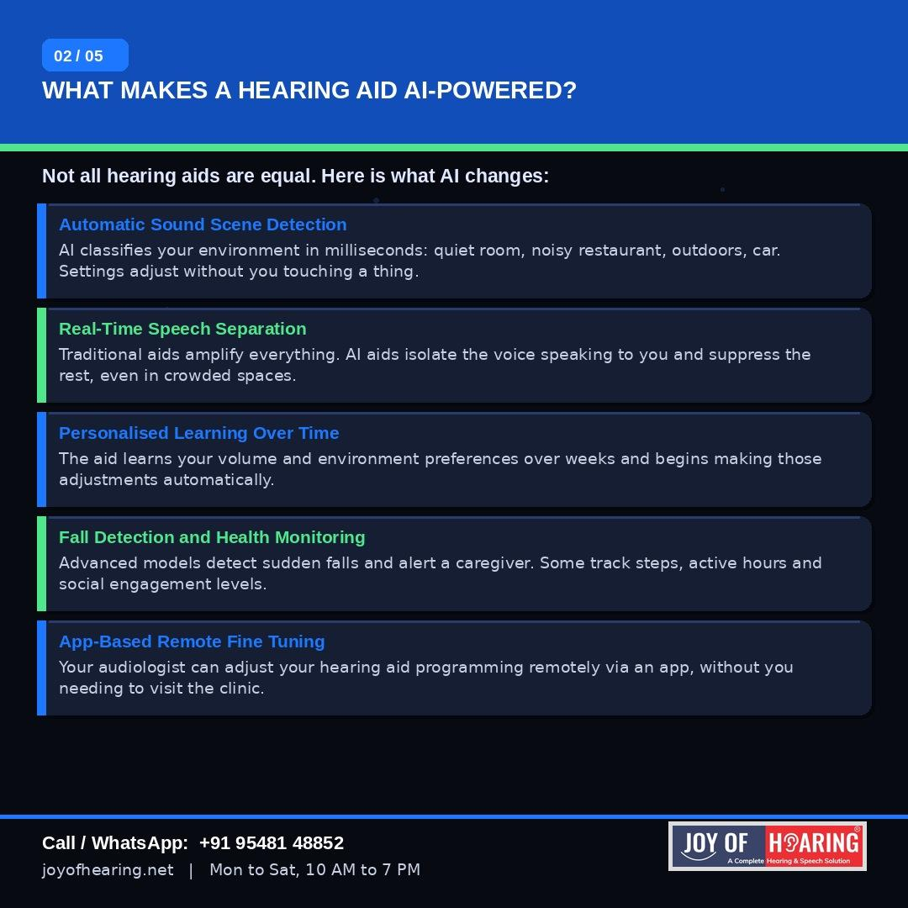
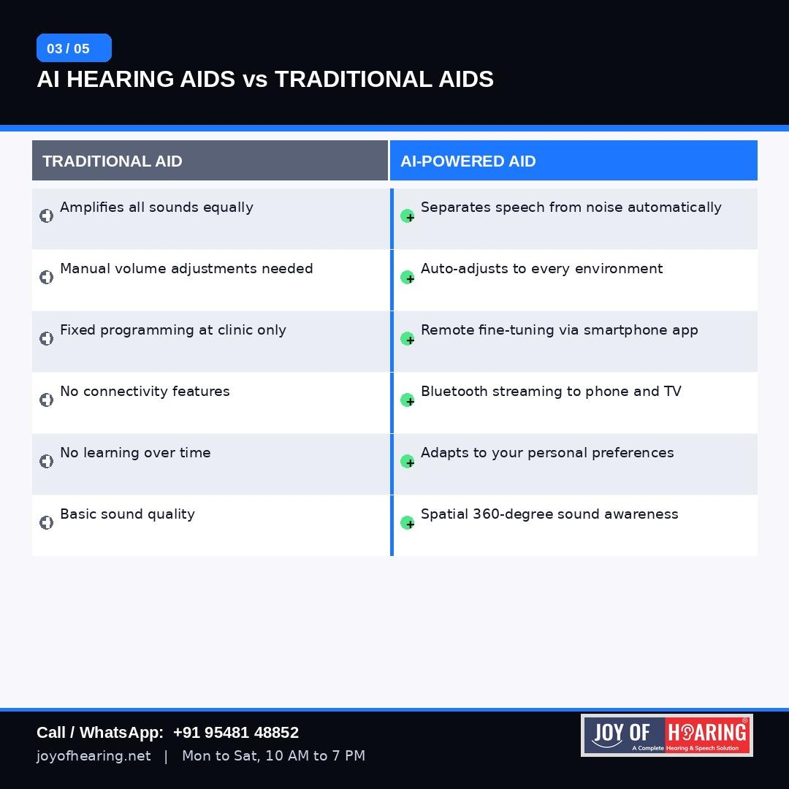
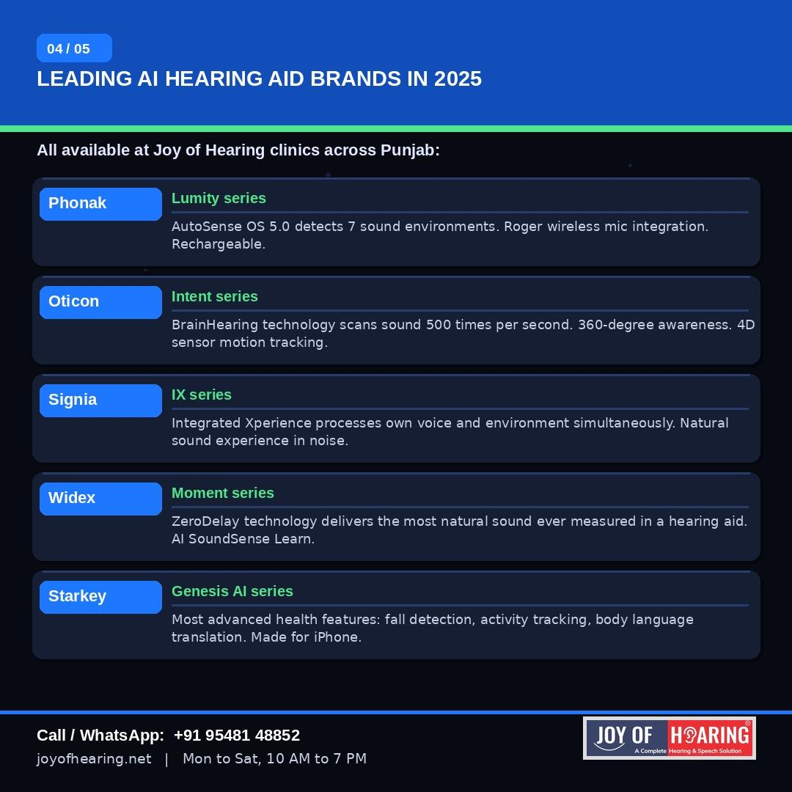
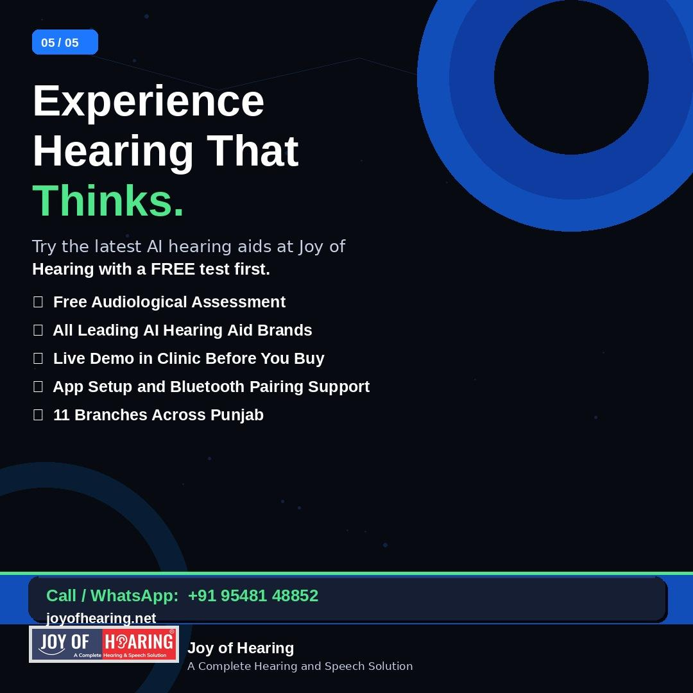

There was a time when a hearing aid did one thing: make sounds louder. Those days are over. Today's most advanced hearing aids carry artificial intelligence processors that rival the computing power found in smartphones, and they are changing what it means to live with hearing loss in ways that were unimaginable a decade ago.

## What Actually Makes a Hearing Aid AI-Powered?

The distinction matters. A standard digital hearing aid processes sound and amplifies it according to a pre-programmed setting. An AI hearing aid does something fundamentally different: it analyses the sound environment in real time, classifies what type of situation you are in, and adjusts hundreds of parameters automatically before you even notice the change.

Walking from a quiet corridor into a busy canteen, stepping outside into wind noise, moving from a one-on-one conversation to a group dinner: an AI aid handles all of these transitions seamlessly, without you touching a button or opening an app.

## Five Ways AI Changes the Experience

Automatic scene detection is the headline feature. Leading AI aids identify up to seven distinct listening environments within milliseconds and reconfigure settings accordingly.

Real-time speech separation is what patients notice most. Rather than amplifying all sounds equally, AI isolates the voice of the person speaking to you and reduces everything else, even in crowded, noisy spaces.

Personalised learning takes this further. The device tracks your manual adjustments over days and weeks and begins making those same changes automatically, building a profile of your preferences over time.

Remote fine-tuning has changed the clinical relationship. Your audiologist can now adjust and reprogram your device through a secure app without requiring a clinic visit.

Health monitoring is the newest frontier. Premium AI aids from brands such as Starkey now include fall detection that alerts a designated contact, activity tracking, and engagement monitoring.

## The Leading AI Hearing Aid Brands Available in India

Phonak's Lumity series uses AutoSense OS 5.0 to classify environments automatically. Oticon's Intent models scan sound 500 times per second using BrainHearing technology. Signia's IX series processes your own voice and your environment simultaneously for a uniquely natural result. Widex Moment delivers what its engineers call ZeroDelay sound, the closest experience to natural hearing ever measured in a device. Starkey's Genesis AI leads on health features including fall detection and body language awareness.

All of these brands are available for fitting and live demonstration across Joy of Hearing's 11 branches in Punjab.

## The Right Starting Point Is Still a Hearing Test

AI aids are remarkable, but the right device still depends on your audiogram. The technology works best when matched precisely to your type and degree of hearing loss by a qualified audiologist. At Joy of Hearing, every patient receives a complete hearing assessment before any recommendation is made.

Call or WhatsApp us at +91 95481 48852 or visit joyofhearing.net to book your free hearing test and experience the latest AI hearing aids in person.

