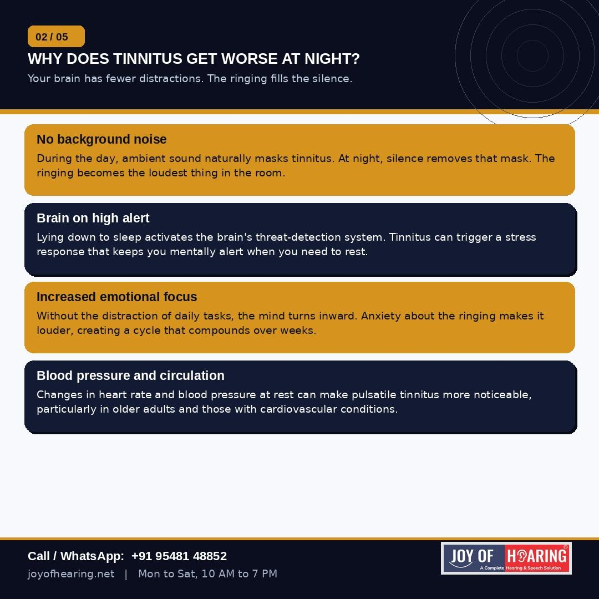
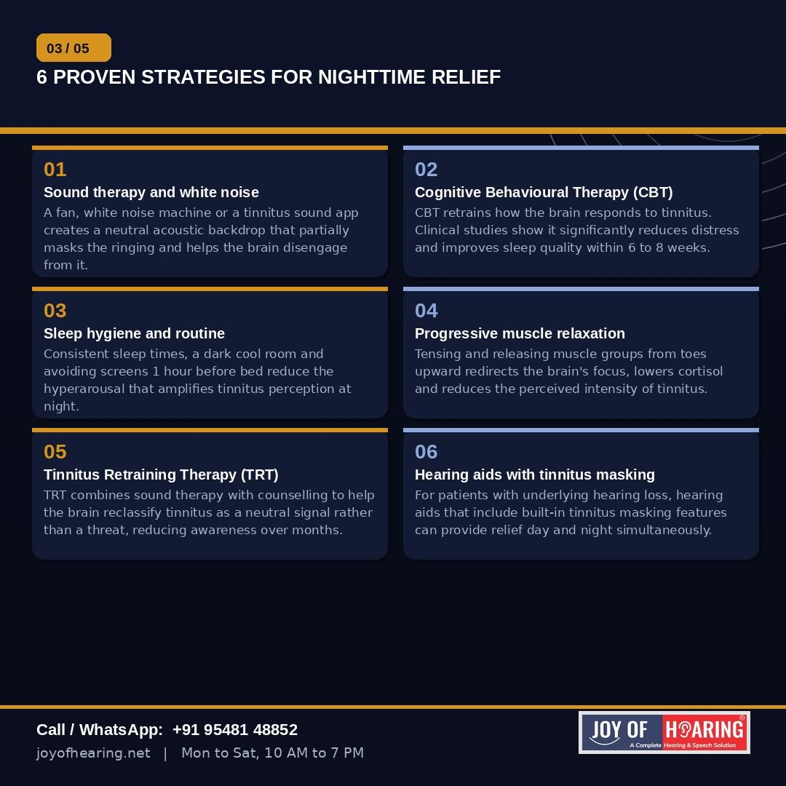
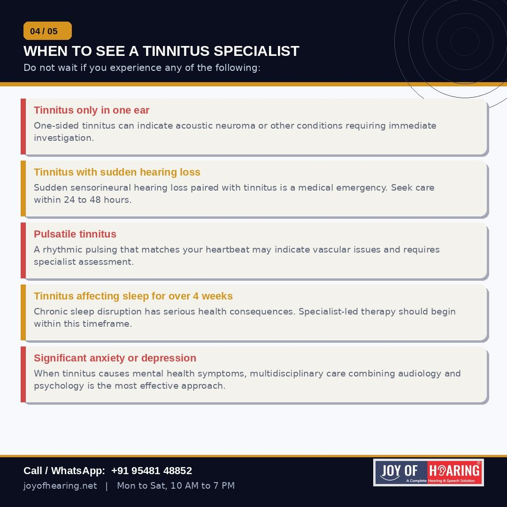
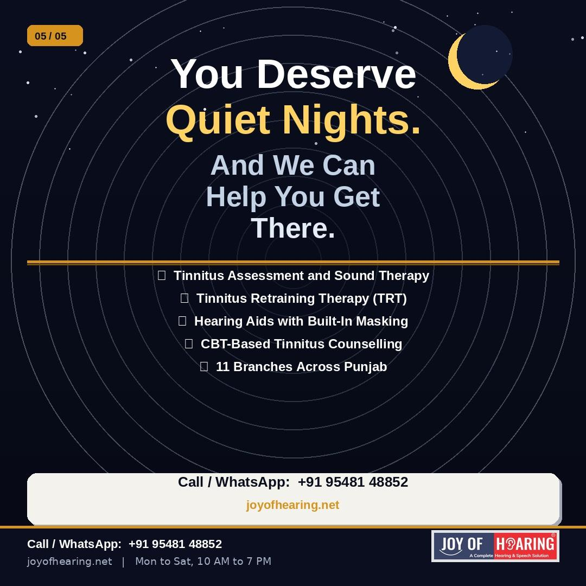

If you have tinnitus, you already know the pattern. The day is manageable. The noise of life provides a kind of natural cover. But the moment you lie down, switch off the light and wait for sleep, the ringing gets louder. Sometimes overwhelmingly so.

You are not imagining it. There is a precise neurological reason why tinnitus intensifies at night and understanding it is the first step toward managing it.

## Why Silence Makes It Worse

Tinnitus is, at its core, a signal generated inside the auditory system rather than from an external source. During the day, the brain processes a constant stream of incoming sounds and the tinnitus signal competes with all of them. At night, that acoustic competition disappears. The ringing or buzzing becomes the dominant signal in your auditory field, and the brain focuses on it in the absence of anything else.

Compounding this is the brain's threat-detection response. When you lie still and attempt to sleep, your nervous system can interpret the tinnitus signal as a potential threat, triggering a mild stress response that keeps you alert. The more you focus on the ringing, the more anxious you become. The more anxious you become, the louder it seems. This cycle can sustain itself for hours.

## Six Strategies That Work

Sound therapy is the most immediate and accessible intervention. A white noise machine, a fan, or a dedicated tinnitus sound app introduces a neutral acoustic background that partially masks the ringing and gives the brain something else to process. Many patients report significant improvement within the first few nights.

Cognitive Behavioural Therapy adapted for tinnitus has the strongest clinical evidence base of any psychological approach. It retrains the brain's emotional response to the sound, reducing distress and improving sleep quality typically within six to eight weeks.

Consistent sleep hygiene reduces the hyperarousal that amplifies tinnitus at night. Fixed sleep and wake times, a dark and cool bedroom, and avoiding screens in the hour before bed all lower the nervous system's baseline state of alertness.

Progressive muscle relaxation diverts the brain's attention away from tinnitus by engaging it in a deliberate physical task, working through muscle groups from the feet upward, releasing tension that accumulates during a difficult day.

Tinnitus Retraining Therapy combines low-level sound generators with structured counselling to help the brain reclassify tinnitus as a neutral, non-threatening signal. Awareness of the sound typically reduces significantly over six to eighteen months of treatment.

Hearing aids with built-in tinnitus masking features address both conditions simultaneously for patients whose tinnitus is linked to underlying hearing loss, which accounts for around 90% of cases.

## When to See a Specialist Without Delay

One-sided tinnitus, tinnitus that pulses in rhythm with your heartbeat, tinnitus that began alongside sudden hearing loss, or tinnitus that is causing anxiety or depression are all signals that specialist assessment is needed promptly rather than eventually.

## Joy of Hearing: Quiet Nights Are Possible

At Joy of Hearing, our tinnitus specialists provide comprehensive assessment, personalised sound therapy, TRT, and hearing aid solutions with built-in masking across 11 branches in Punjab. You do not have to simply endure the ringing.

Call or WhatsApp us at +91 95481 48852 or visit joyofhearing.net to book your tinnitus consultation today.

