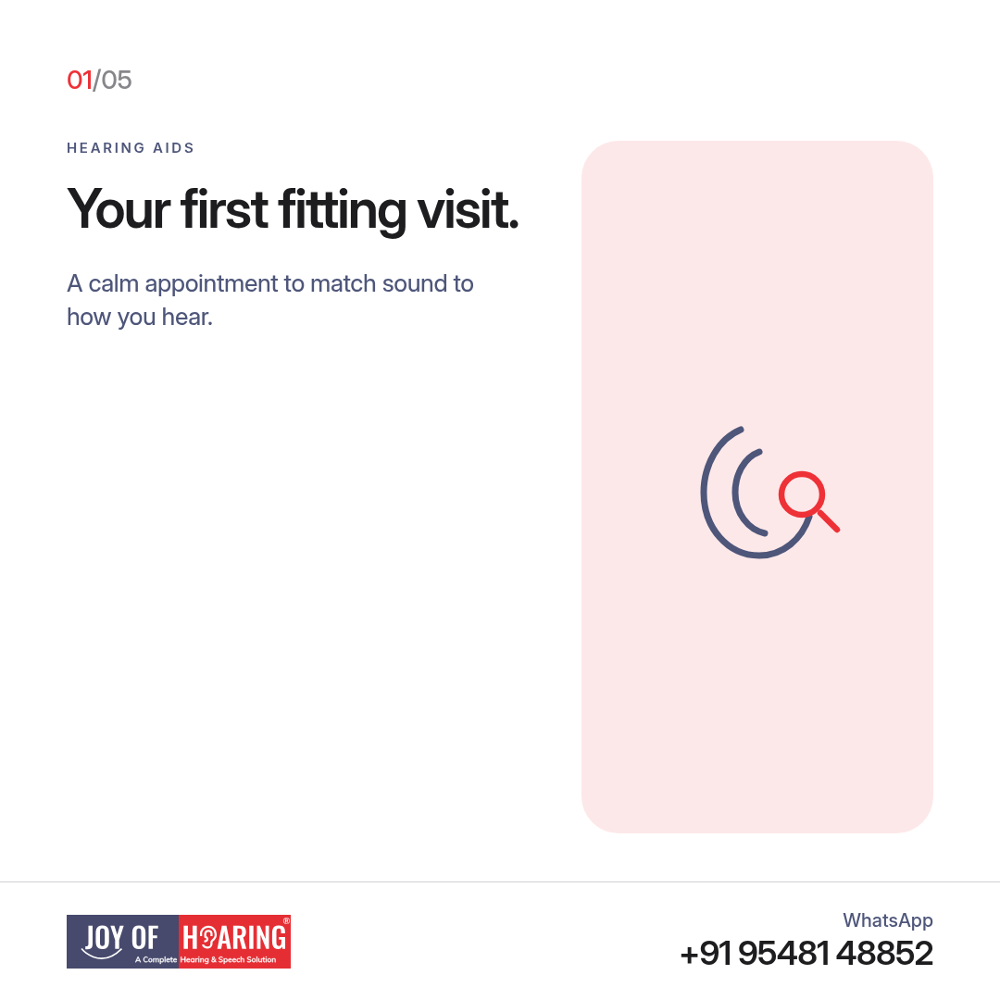
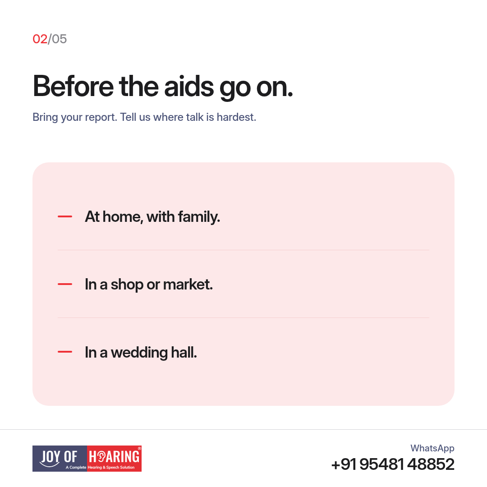
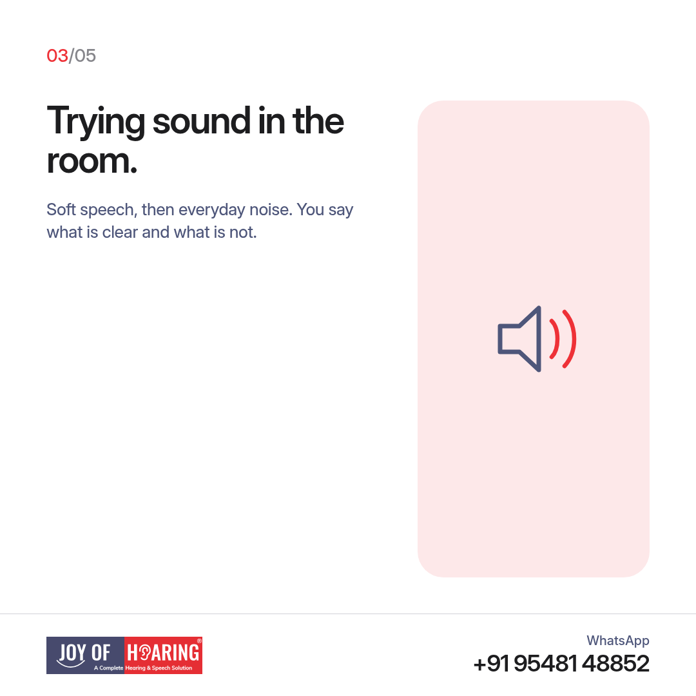
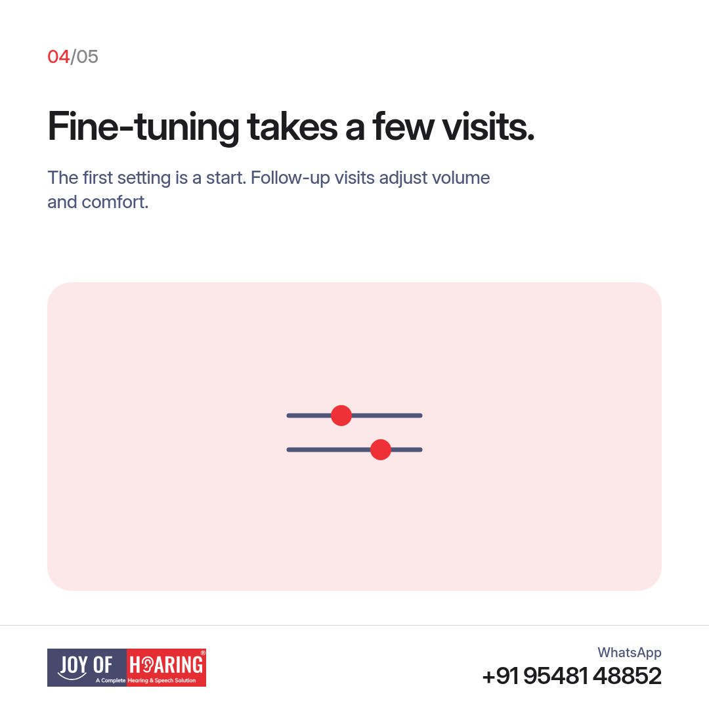

A hearing aid fitting is not a product demo. It is a calm visit where we match sound to how you hear, then check that speech feels clear in the room before you step back into daily life.

Most people arrive after a hearing assessment. Some already wear aids that no longer feel right. Either way, the visit is paced. You stay seated. You say what sounds sharp, soft, or distant. The goal is comfort and clarity, not a hurried sale.

## Before the aids go on

Bring your latest hearing report if you have one. Tell us where talk is hardest: at home with family, in a shop or market, or in a wedding hall. Say if one ear feels weaker, if soft voices disappear first, or if the television is always louder than everyone else wants. A family member who hears you day to day is welcome in the room for this part.

We also check the ear canal and how the shell or soft tip sits. A poor fit can make sound whistle or feel blocked. Sorting that early saves frustration later.

## Trying sound in the room

Once the aids are on, we start with soft speech, then add everyday noise. You tell us what is clear and what is not. We may ask you to repeat words, follow a short conversation, or notice whether your own voice feels natural. Nothing here is a pass or fail. Your feedback steers the setting.

If something feels too sharp or too quiet, say so in the moment. Small changes in the room are easier than guessing alone at home that evening.

## Fine-tuning takes a few visits

The first setting is a start, not the final answer. Real life is louder and messier than a clinic room. Follow-up visits adjust volume, comfort, and how speech holds up in noise. Wear the aids between visits so we can hear what changed. Bring notes: which places felt better, which still tire you.

If wax builds up, or if the tip no longer sits well, we sort that before we chase more programme changes. Comfort comes first.

## What you practise at home

We show you how to put the aids on, take them off, and keep them dry and clean. Ask about batteries or charging before you leave. Practise inserting them at the clinic until it feels ordinary. If a family member will help, have them watch once.

## Joy of Hearing: book a hearing aid fitting

At Joy of Hearing, hearing aid fitting and follow-up fine-tuning are available across 11 branches in Punjab.

Call or WhatsApp us at +91 95481 48852 or visit joyofhearing.net to book your hearing aid fitting today.
