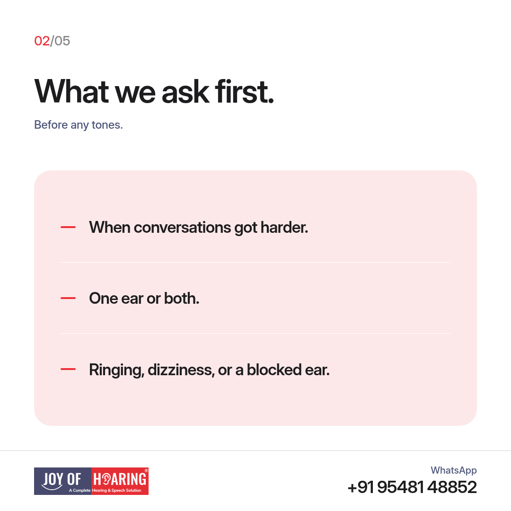
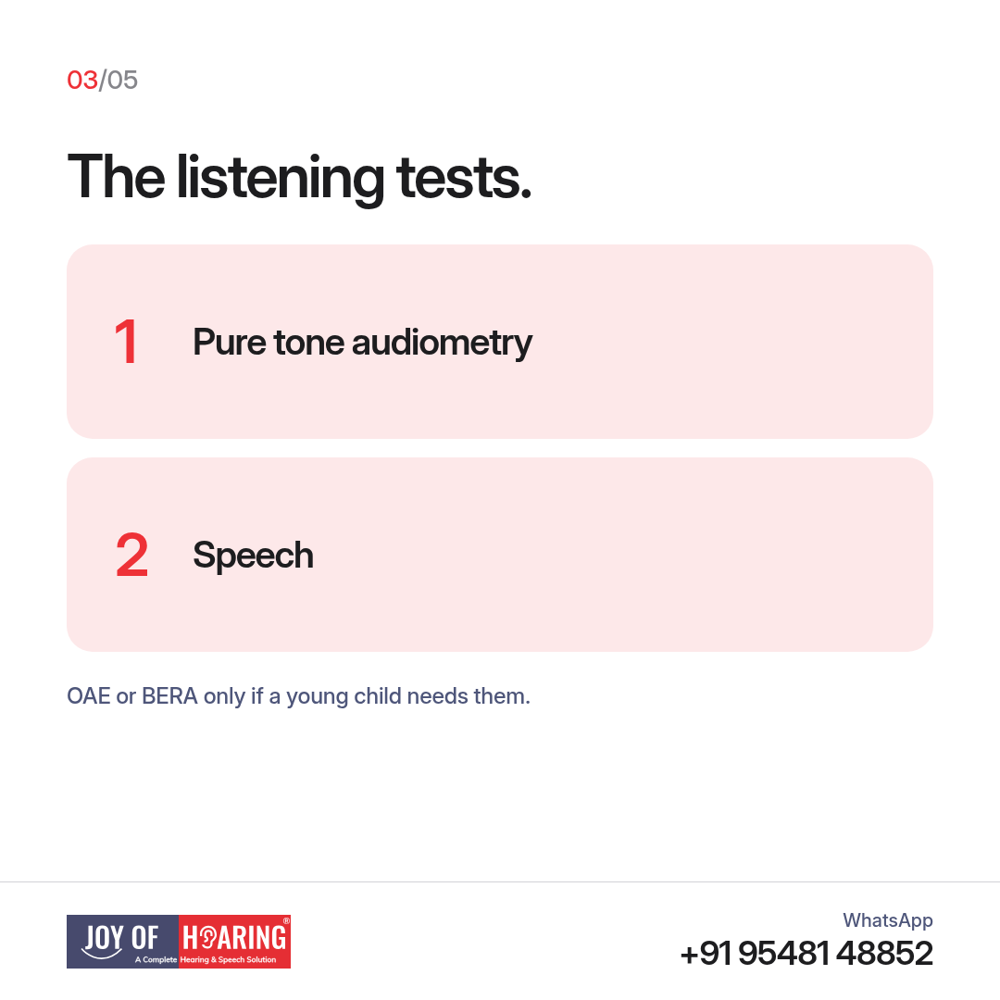
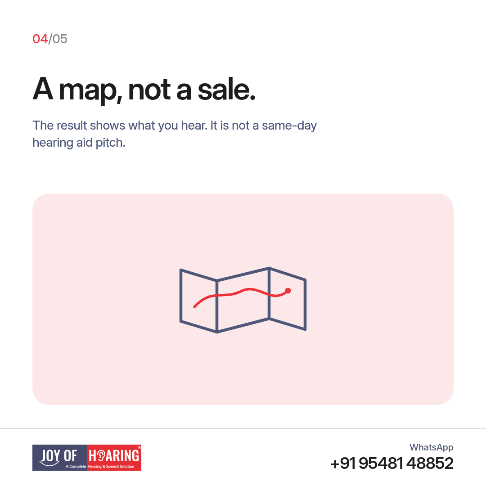
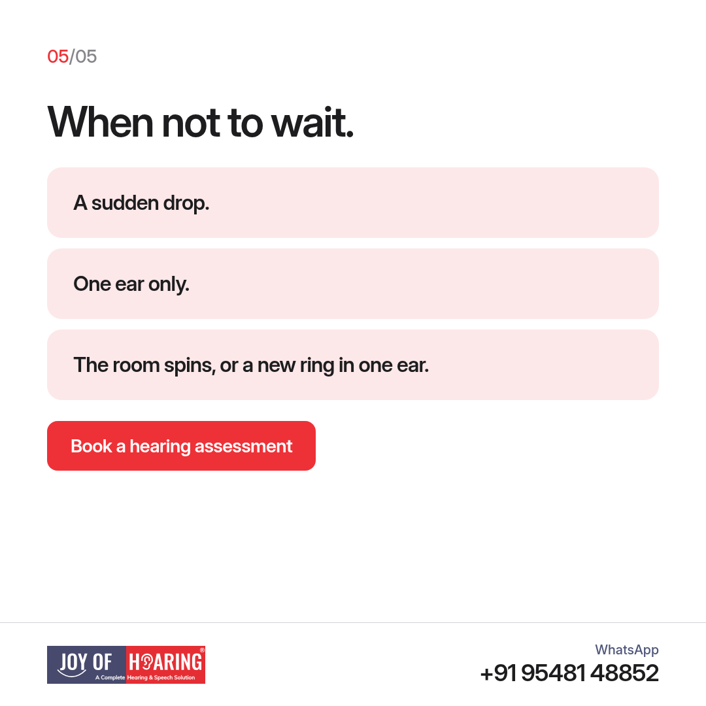

Most people picture a hearing test as a long hospital procedure. It is usually a calm visit in a quiet room. You talk, you listen, and you leave with a clear picture of what your ears are doing.

## What we ask before any tones

The visit starts with your story. When did conversations get harder? One ear or both? Any ringing, dizziness, or a cold that left one ear blocked? We also ask about noisy work, wedding halls, farm machinery, and headphones. A family member is welcome in the room for this part. They often notice the television volume before you do.

Then we look in the ear canal. Wax, a narrow canal, or irritation from a cotton bud can change the result, so that look comes before the listening. If the canal needs clearing, we say so before the test goes further. You stay seated. Nothing here is a surgery.

## The listening tests

Pure tone audiometry finds the softest beeps you can hear, from low notes to high ones, one ear at a time. You will wear headphones, or a band behind the ear if headphones are uncomfortable. Raise a hand or press a button each time you hear a tone, even a faint one.

A speech test checks whether you can make out words, not just tones. Some words are easy. Some are close to other words. That gap matters in a noisy shop or a family dinner. If a young child cannot do this yet, we use other checks, including otoacoustic emissions, called OAE, or brainstem testing, called BERA, when they are needed. You do not need to prepare. Guessing is fine.

## What the result is for

The result is a map of your hearing. It shows whether a hearing aid trial, a medical referral, or a later review makes sense. It does not mean you must take a device home that day. Bring any old reports if you have them. If you already wear hearing aids, the same visit can check whether they still match how you hear now.

## When not to wait

Book sooner if hearing dropped suddenly, if only one ear changed, if the room spins, or if a new ring sits in one ear. Book sooner if a child stops turning to their name. Those are reasons for a prompt hearing assessment, not a few more weeks of waiting.

## Joy of Hearing: book a hearing assessment

At Joy of Hearing, a hearing assessment covers your history, an ear-canal exam, pure tone audiometry, and speech tests across 11 branches in Punjab.

Call or WhatsApp us at +91 95481 48852 or visit joyofhearing.net to book your hearing assessment today.
