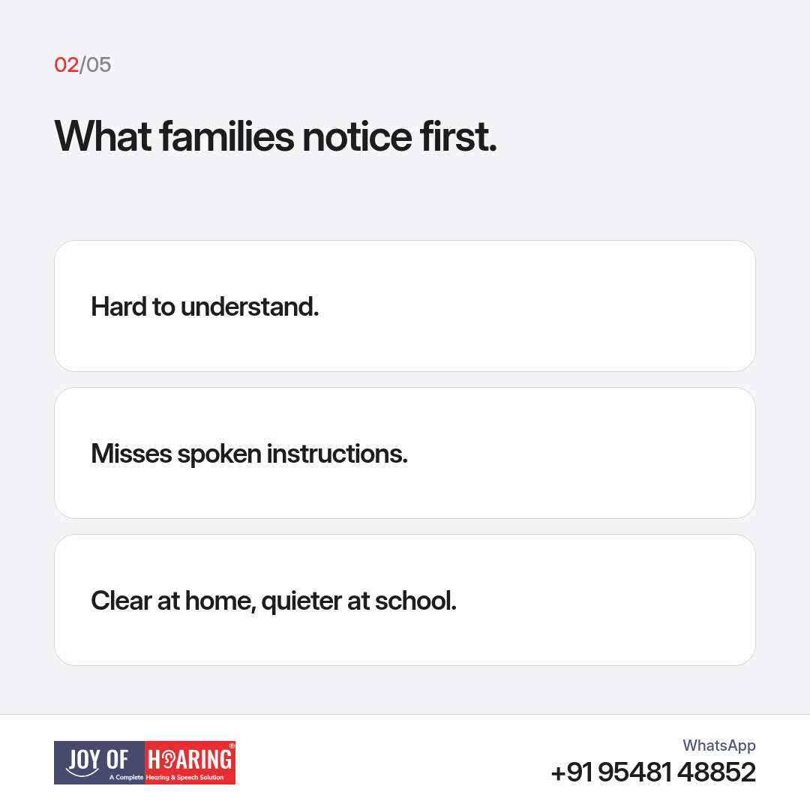
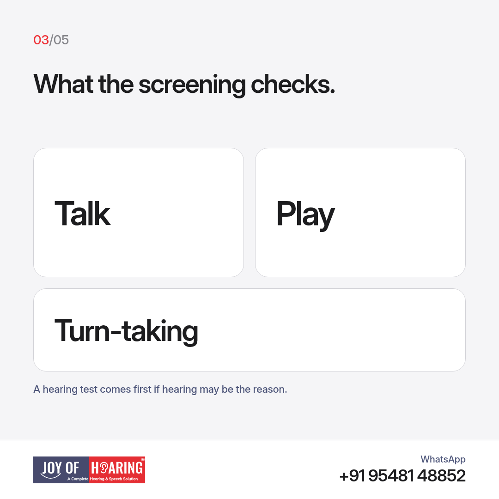
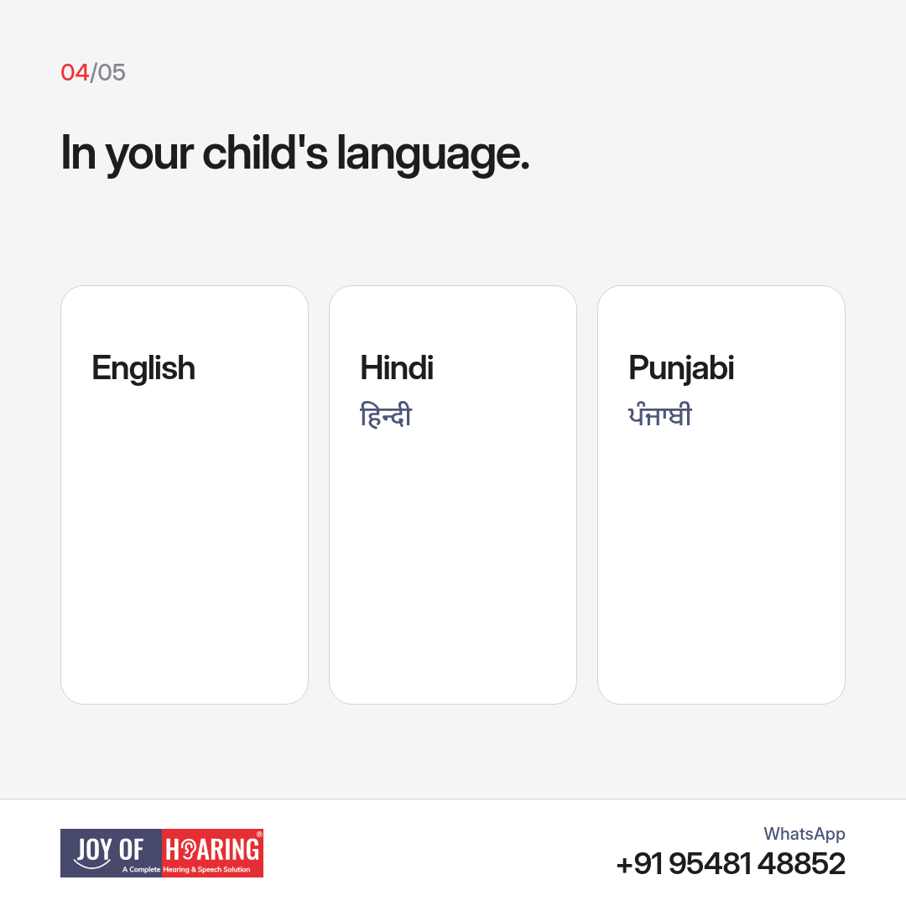
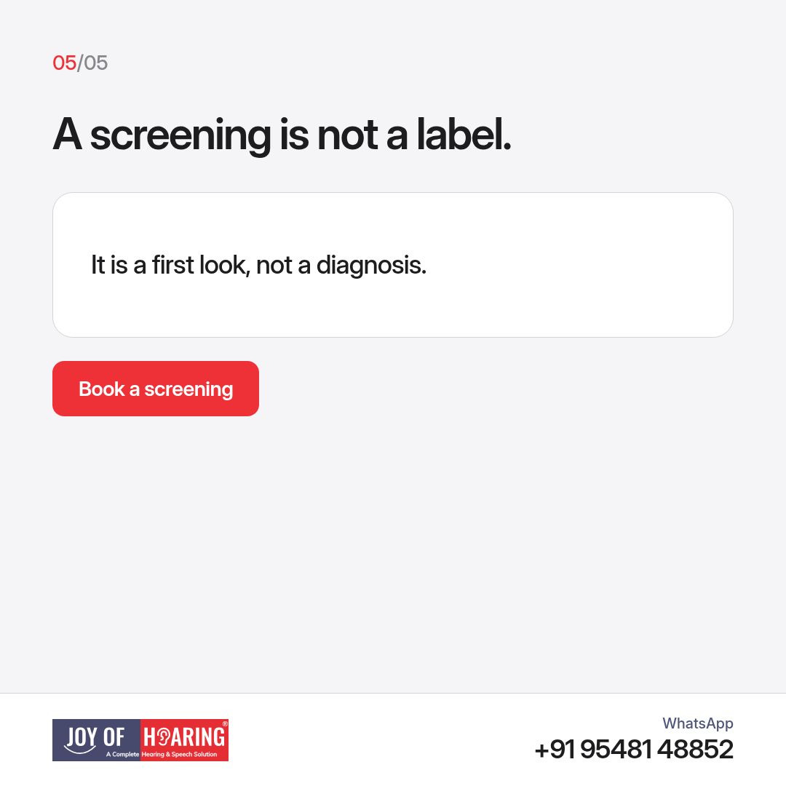

A late first word, or a child who is clear at home and quiet at school, is easy to explain away. A speech and language screening is a short visit that tells you whether to watch, to help at home, or to start therapy.

## What families notice first

You might hear the same worry in different words. The child is hard to understand well past the toddler years. They follow a routine but miss spoken instructions. They stumble on sounds when they are excited. They speak easily in Punjabi at home and struggle when school is in English or Hindi. Grandparents may say a cousin was the same and grew out of it. Sometimes that is true. A screening is how you find out, instead of waiting through another school year.

Any of these is a fair reason to book, not a reason to panic. Bring the questions you have been saving. A parent or grandparent who hears the child every day is part of the visit.

## What the screening checks

A screening looks at how the child understands, how they speak, and how they use words with another person. It is a conversation and a few simple tasks, not a written exam. We watch play, naming, and how the child takes a turn in talk. If hearing may be part of the picture, we say so. A child who cannot hear speech clearly can look as if language is the only issue. In that case a hearing test comes before a long speech plan.

## English, Hindi, or Punjabi

The screening is available in English, Hindi, and Punjabi. Pick the language the child actually uses at home. A result is more useful when the child is not translating while they talk. If the child mixes two languages, tell us. Mixing on its own is not a problem. We want the language they are most at ease in.

## A screening is not a label

Nothing in the visit stamps a child with a lifelong name. It answers a practical question: is speech coming along as we would expect, and what is the next step? Sometimes the next step is advice for home. Sometimes it is speech therapy. Sometimes it is a hearing test first. You leave with that next step in plain words. Ask us to write it down before you go. There is no form to revise at home the night before.

## Joy of Hearing: book a speech and language screening

At Joy of Hearing, speech and language screening and speech therapy are available across 11 branches in Punjab.

Call or WhatsApp us at +91 95481 48852 or visit joyofhearing.net to book your speech and language screening today.
