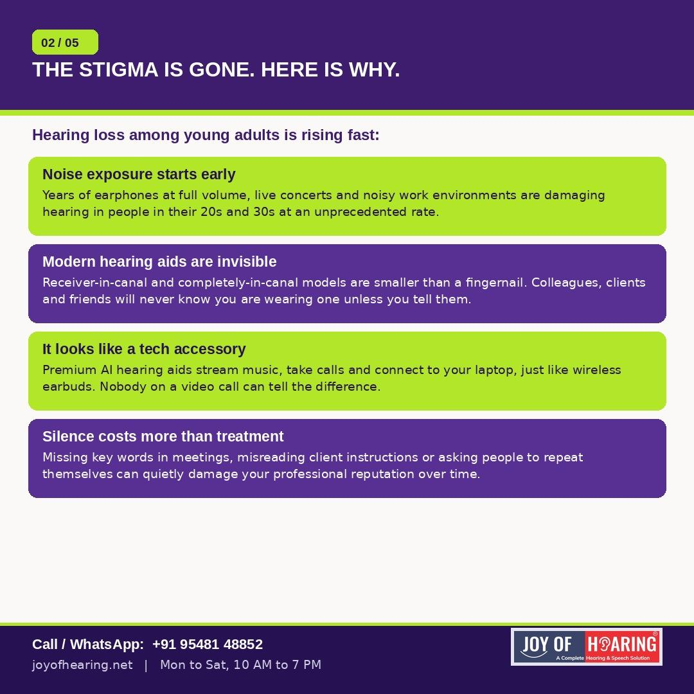
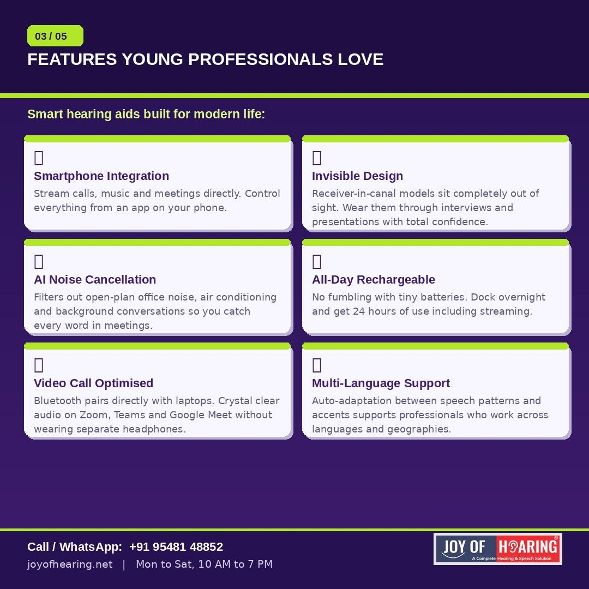
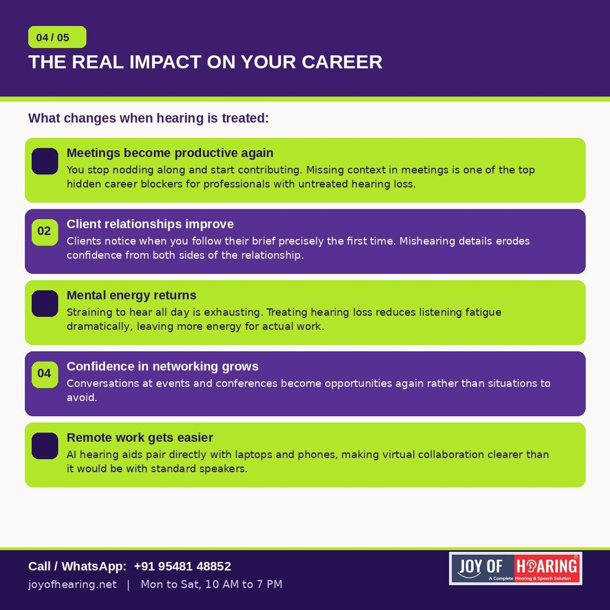
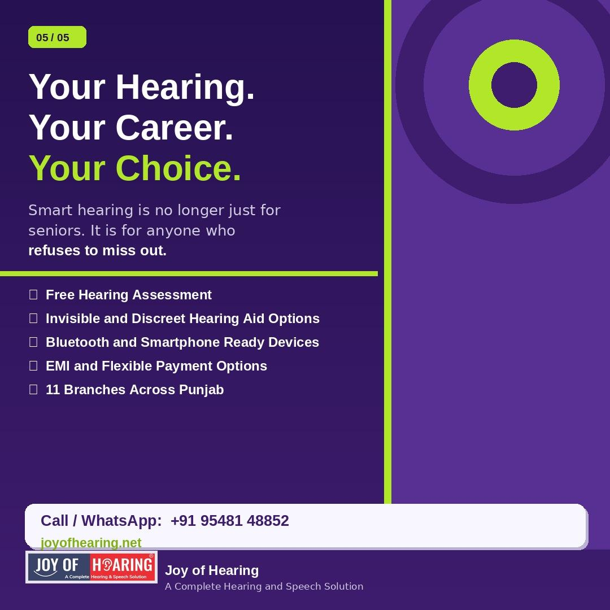

There is a quiet shift happening in audiology clinics across India. The patients walking in are younger than ever before: software engineers, marketing managers, teachers, consultants and entrepreneurs in their twenties and thirties who have decided that untreated hearing loss is simply too costly to ignore.

Smart hearing is no longer just for seniors. Here is why a new generation is choosing to act early.

## The Numbers Are Changing

Research suggests that 1 in 5 adults under the age of 45 now experiences some degree of measurable hearing loss. Years of earphone use at high volumes, exposure to loud open-plan offices, concerts and urban noise environments have accelerated hearing damage in younger demographics at a rate previous generations never faced. Yet despite the prevalence, nearly 65 per cent of young adults with hearing loss delay seeking treatment, most citing stigma as the primary reason.

That stigma is fading fast and technology is the reason why.

## Modern Hearing Aids Do Not Look Like Hearing Aids

The devices available today bear no resemblance to the beige, bulky aids associated with an older generation. Receiver-in-canal and completely-in-canal models are smaller than a fingernail and sit entirely out of sight within the ear canal. Premium models from brands like Phonak, Oticon and Signia look, on the outside, indistinguishable from high-end wireless earbuds.

More importantly, they work like premium wireless earbuds. Bluetooth streaming from smartphones and laptops, direct audio routing for video calls on Zoom and Teams, seamless switching between calls and music, and app-based controls from your phone are all standard features on mid to premium AI hearing aids.

## The Career Case Is Compelling

Hearing loss in a professional environment creates compounding costs that most people do not fully attribute to their hearing. Missing key words in client briefs leads to avoidable errors. Struggling to follow fast-paced meetings means contributing less. Listening fatigue after hours of straining to hear drains energy that should be directed at actual work. Avoiding networking events because group conversations are too difficult limits professional growth in ways that are difficult to measure but very real.

Treating hearing loss removes these silent drains. Professionals who act early consistently report improved confidence in meetings, stronger client relationships and a significant reduction in daily mental fatigue.

## What Smart Hearing Looks Like in Practice

An AI hearing aid for a young professional automatically adjusts between the open-plan office, a meeting room, a noisy client lunch and a video call, without the wearer changing a setting. Some models pair with smartwatches. Some stream live captions. All of them allow the wearer to simply be present in every conversation without the cognitive overhead of straining to hear.

## Joy of Hearing: Start With a Free Test

At Joy of Hearing, we work with young professionals across 11 branches in Punjab who are making this choice every week. The process starts with a free hearing assessment, followed by a live demonstration of devices suited to your lifestyle, work environment and preferences. No pressure, no assumptions, no age limit on better hearing.

Call or WhatsApp us at +91 95481 48852 or visit joyofhearing.net to book your free assessment today.

